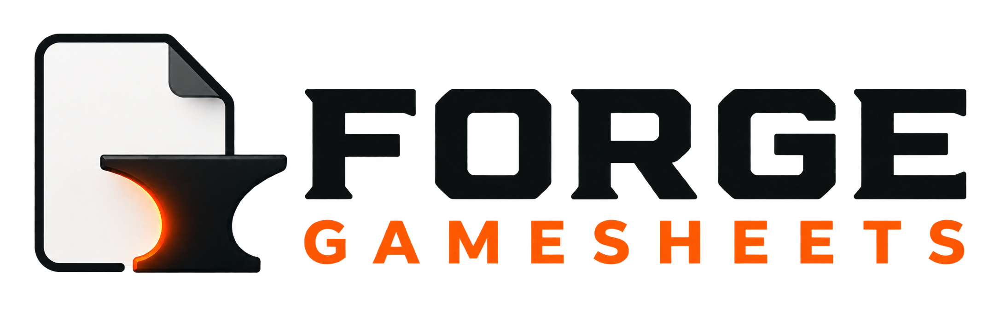

<p align="center">
  
</p>

# Forge GameSheets

**Organize. Customize. Print. Play.**

Forge GameSheets is a self-hosted library for board-game rules, score sheets,
player references, and other printable PDF resources. It scans ordinary folders
on disk and provides a responsive browser interface for organizing, finding,
viewing, downloading, and printing those files.

Phase 1 is feature-complete for local beta testing. It does not modify source
PDFs, require a cloud service, or store PDF contents in its database.

## Phase 1 features

- Recursive PDF discovery beneath one first-level folder per game
- Forgiving filename parsing and document-type recognition
- Search across game and resource titles
- Browser viewing, downloads, and first-page PDF previews
- Optional FORGE Reprint copies with a QR return link and source-rights notice
- Editable display titles, document metadata, and game artwork
- Multiple customizable categories per game
- All Games, category, and Uncategorized browsing
- Favorites, up to ten pinned homepage resources, Recent, and use history
- Configurable library footer and Recent limit
- Manual rescans with safe partial-scan and missing-file behavior
- Responsive, keyboard-accessible server-rendered pages
- SQLite migrations that preserve application state across restarts

The approved scope and roadmap are in [PROJECT_PLAN.md](PROJECT_PLAN.md).

## Requirements

- Docker Desktop or another Docker installation with Compose support
- A local directory containing the PDF library
- A separate writable directory for Forge GameSheets application data

The included `compose.yml` uses the repository's `library/` and `data/`
directories and binds the application only to `127.0.0.1:8000`.

For a persistent Docker-host installation, access-model guidance, upgrades,
backups, and troubleshooting, follow the
[self-hosted beta deployment guide](docs/deployment.md).

## Quick start

1. Put game folders inside `library/`:

   ```text
   library/
   ├── Farkle/
   │   ├── Farkle - Rules.pdf
   │   └── Farkle - Score Sheet.pdf
   └── Yahtzee/
       └── Yahtzee - Score Sheet.pdf
   ```

2. Build and start the application:

   ```sh
   docker compose up --build
   ```

3. Open <http://localhost:8000>.

4. Stop the application with `Ctrl+C`.

The health endpoint is available at <http://localhost:8000/health>.

## Self-hosted beta configuration

The Compose defaults are intentionally local and use the repository's `data/`
and `library/` directories. To override them, copy `.env.example` to `.env` and
change only the values needed for the host:

| Setting | Default | Purpose |
| --- | --- | --- |
| `FORGE_GAMESHEETS_BIND_ADDRESS` | `127.0.0.1` | Host address that accepts connections |
| `FORGE_GAMESHEETS_PORT` | `8000` | Host port used to open Forge |
| `FORGE_GAMESHEETS_BASE_URL` | unset | Address encoded into FORGE Reprint QR links |
| `FORGE_GAMESHEETS_DATA_PATH` | `./data` | Writable application state |
| `FORGE_GAMESHEETS_LIBRARY_PATH` | `./library` | Source PDF library, mounted read-only |
| `FORGE_GAMESHEETS_VERSION` | `development` | Release name shown in Settings and health diagnostics |
| `FORGE_GAMESHEETS_REVISION` | unset | Git revision embedded in the built image |
| `FORGE_GAMESHEETS_BUILD_DATE` | unset | UTC build date embedded in the built image |

For a development build that identifies the exact checked-out code, build with
the current Git revision and UTC date:

```sh
FORGE_GAMESHEETS_REVISION="$(git rev-parse --short HEAD)" \
FORGE_GAMESHEETS_BUILD_DATE="$(date -u +%F)" \
docker compose build
```

These details appear at the bottom of Settings and in `/health`. Release builds
can also set `FORGE_GAMESHEETS_VERSION` to the published version. Values are
embedded when the image is built, so changing them requires rebuilding it.

On a Linux Docker host using the default bind mount, prepare the data directory
for Forge's fixed non-root container identity before the first start:

```sh
sudo chown -R 10001:10001 data
```

Do not apply that ownership change to the source PDF library. It only needs to
be readable by the container. Docker Desktop for macOS and Windows normally
handles bind-mount permissions through its file-sharing layer.

For access from another device on a trusted private LAN, set
`FORGE_GAMESHEETS_BIND_ADDRESS=0.0.0.0` in `.env`, then open the configured port
on the Docker host. Forge has no built-in authentication: never expose that
port directly to the public Internet or an untrusted network. Remote access
requires an appropriate authenticated proxy, VPN, or network access-control
layer.

After a detached start, allow initialization to finish and verify readiness:

```sh
docker compose ps
curl --retry 10 --retry-all-errors --retry-delay 1 \
  http://127.0.0.1:8000/health
```

## Organizing files

Each first-level directory inside `library/` represents one game. PDFs can be
nested beneath that game directory. The preferred filename is:

```text
<Game Name> - <Document Type> [optional variant].pdf
```

Names do not need to be perfect. Unrecognized PDFs remain accessible under
Other, and display metadata can be corrected in the interface without renaming
the source file. Select **Rescan library** after changing library contents.

Optional game artwork can be placed at the top of a game folder using the name
`icon` or `cover` and a PNG, JPEG, or WebP extension. Artwork can also be
uploaded through **Edit game entry**.

## Application data and backups

The source PDFs remain in `library/`. The `data/` directory contains the SQLite
database, uploaded artwork, and regenerable caches. Back up both directories:

- `library/` preserves original PDFs and detected artwork.
- `data/` preserves titles, categories, favorites, pins, settings, activity,
  and uploaded artwork.

Stop the application before making a simple filesystem copy of `data/`. See
[Backup and recovery](docs/BACKUP_AND_RECOVERY.md) before upgrades or migration.

## Security boundary

Phase 1 has no authentication or user accounts. The supplied Compose file is
intended for local beta use and listens only on localhost. Do not expose it to
the internet or an untrusted network without an intentionally designed access
and authentication layer.

The library mount is read-only. Forge GameSheets never edits source PDFs.

## Content rights and responsibility

Forge GameSheets is self-hosted software. It does not provide, sell, upload,
inspect, or verify the PDFs placed in an operator's library. The library
operator controls those files and is responsible for ensuring that their
storage, reproduction, use, printing, and distribution are permitted by the
rights holder, applicable license terms, public-domain status, or applicable
law.

The FORGE GAMESHEETS mark on a generated reprint identifies the software used
to prepare that copy. It does not claim authorship or ownership of the source
content and does not imply affiliation with or endorsement by its rights
holders. A FORGE Reprint does not itself grant permission to reproduce or
distribute a source PDF.

QR links point back to the operator's own Forge installation. Depending on its
network configuration, that link may make a resource reachable from other
devices. Forge has no built-in authentication, so operators must not expose
protected resources directly to the public internet or an untrusted network.

## Testing and development

Run the automated checks in the container:

```sh
docker compose build
docker compose run --rm app pytest
docker compose run --rm app ruff check .
```

Developer workflow details are in [docs/DEVELOPMENT.md](docs/DEVELOPMENT.md).
Beta testers should follow [docs/BETA_TESTING.md](docs/BETA_TESTING.md).

## Current limitations

- Printing is handled by the browser's PDF viewer; the application cannot
  reliably detect whether a print completed.
- PDF previews show only the first page and may be unavailable for malformed or
  unsupported PDFs.
- FORGE Reprint creates a marked derived copy but does not edit, combine, or
  replace source PDFs.
- Game folders must currently be first-level children of the library root.
- There is no BoardGameGeek enrichment, remote synchronization, or cloud backup.
- Production deployment and public network exposure have not been approved.

See [Phase 1 release checklist](docs/PHASE1_RELEASE_CHECKLIST.md) for beta
readiness, [beta release notes](docs/PHASE1_BETA_RELEASE_NOTES.md) for the
timeline-free public summary, and
[browser PDF printing](docs/decisions/001-browser-pdf-printing.md) for the
print-history decision.

## License

Forge GameSheets is available under the [MIT License](LICENSE).
