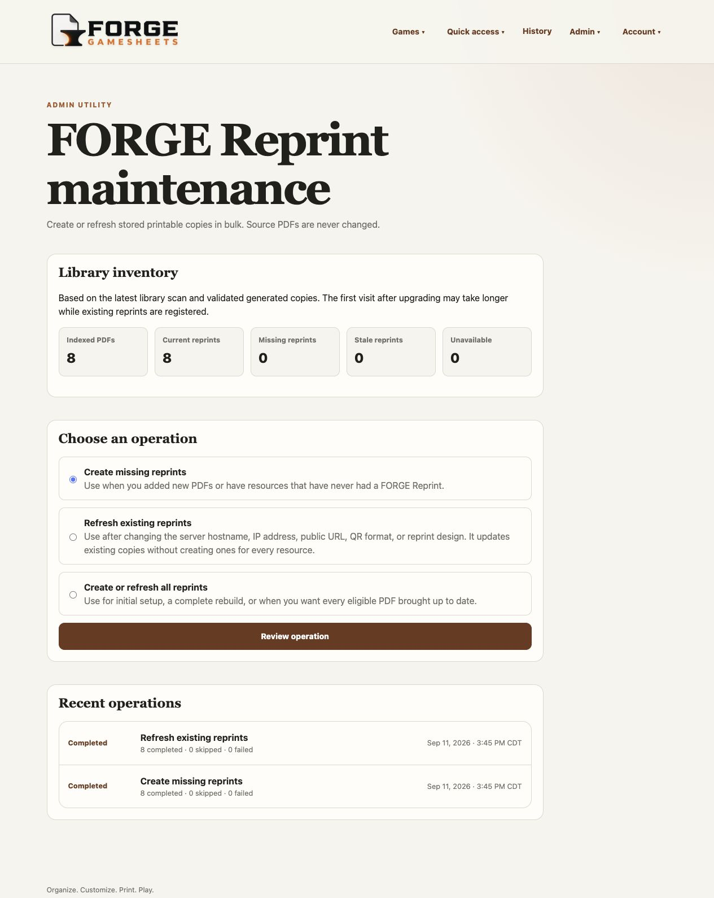
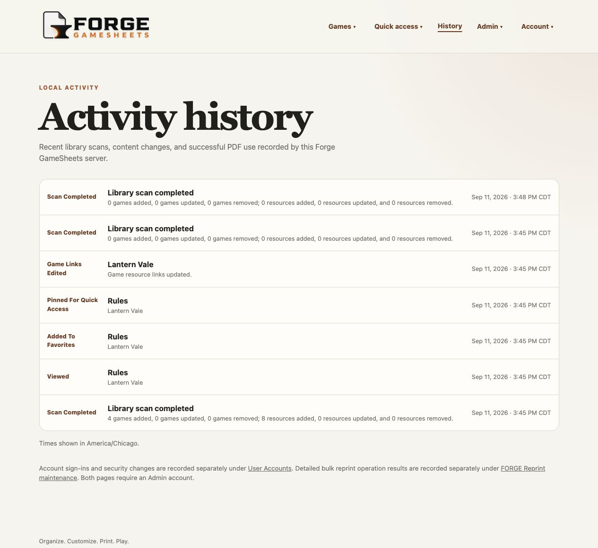
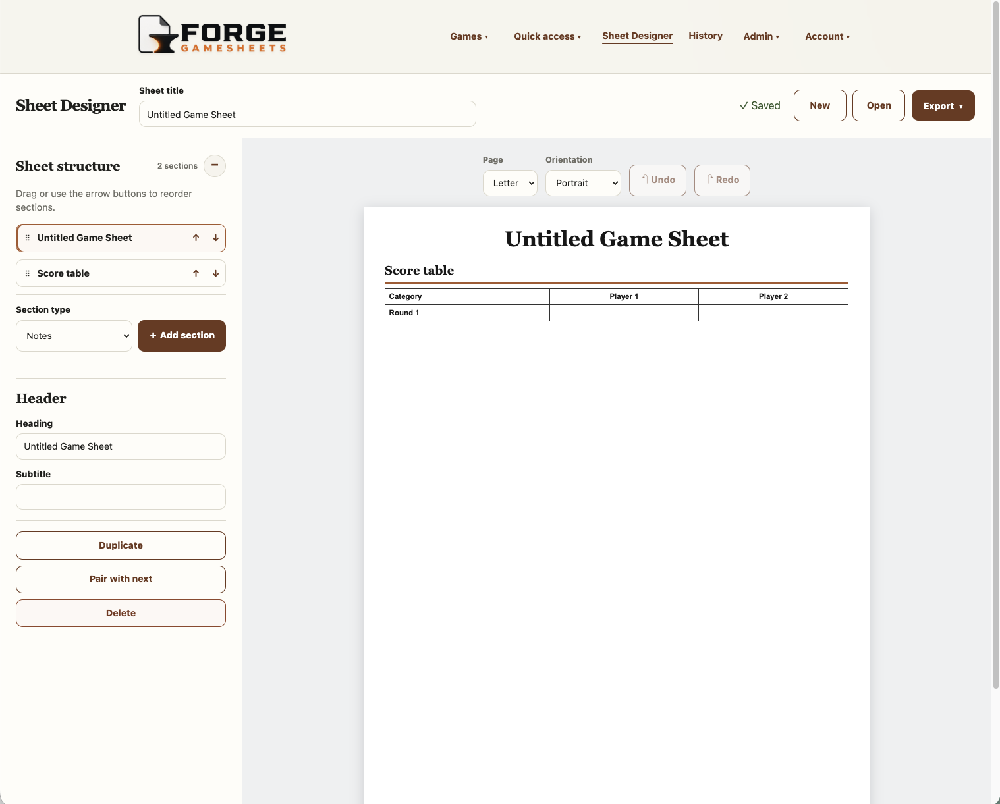
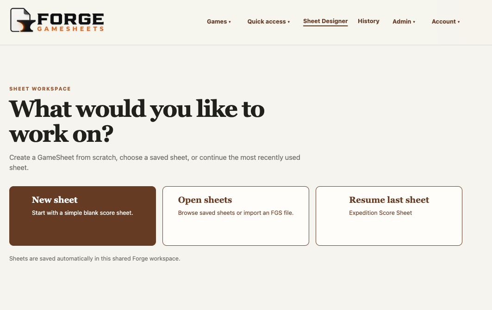
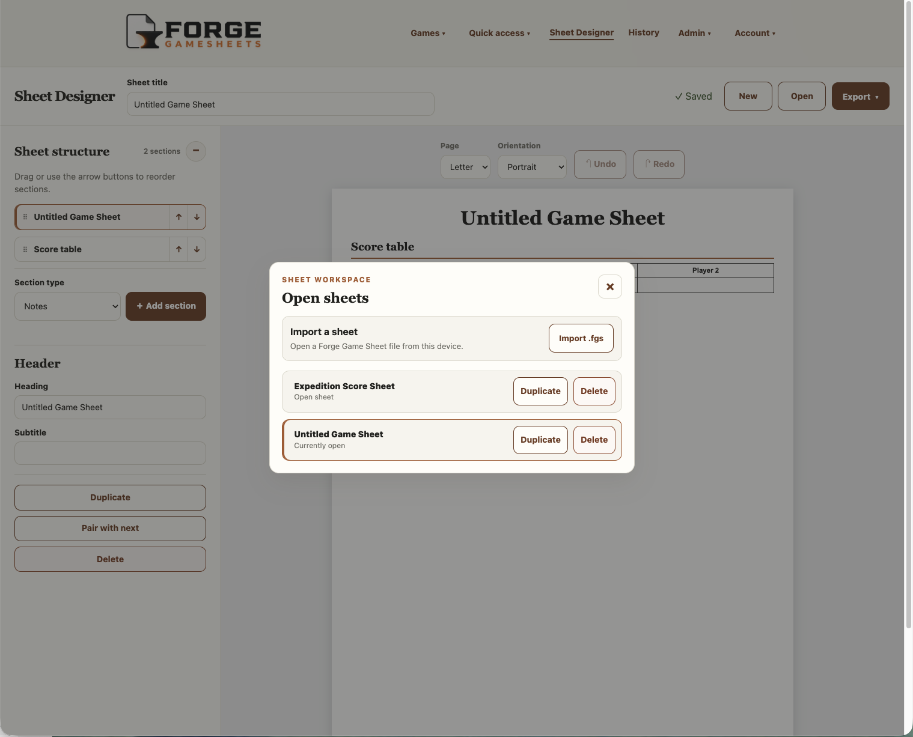
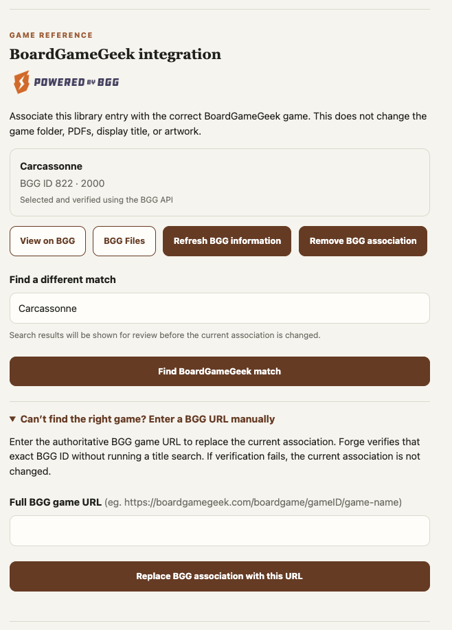

<p align="center">
  
</p>

# Forge GameSheets

**Collect. Create. Print. Play. Or Go Live with LiveSheets.**

Forge GameSheets is a self-hosted home for the documents and custom sheets used
at your gaming table. Organize and search PDF rulebooks, score sheets, player
aids, references, and print-and-play files—all from a browser.

Need a sheet that doesn’t exist yet? Use the visual Sheet Designer to build one
from scratch, then save it as a portable FGS file or export it as a printable
PDF. Compatible GameSheets can also become temporary LiveSheets with automatic
totals and live updates across devices. One person can score while everyone
else follows along, or each player can enter and track their own scores.

Forge GameSheets is currently in beta. Your source PDFs and saved GameSheets
remain under your control: the application works locally, does not require a
cloud service, and does not modify source PDFs. Sheet Designer creates new
sheets; it is not an editor for existing PDF files.

## Available features

- Recursive PDF discovery beneath one first-level folder per game
- Forgiving filename parsing and document-type recognition
- Search across game and resource titles
- Browser viewing, descriptive download filenames, and first-page PDF previews
- Optional FORGE Reprint copies with a QR return link and source-rights notice
- Admin bulk maintenance to create missing, refresh existing, or rebuild all
  eligible FORGE Reprints with durable progress and per-resource results
- Integrated Sheet Designer for creating new structured game sheets from
  scratch, with headers, score tables, references, checklists, notes, live page
  preview, automatically saved drafts, PDF or `.fgs` export, and optional
  association with an existing library game
- A versioned FGS Page Rendering Profile and pinned shared renderer used by the
  Designer preview and PDF export and by the browser-only FGS Studio
- Temporary LiveSheet sessions with single-scorer or individual-player entry,
  QR and copyable-link invitations, automatic totals, and host-managed notes
  and milestones
- Editable display titles, document metadata, and game artwork
- Multiple customizable categories per game
- Bulk category assignment with filtering, selection, and confirmation before changes
- Optional trailing folder-category hints, such as `Yahtzee [Dice, Children]`
- Optional local Admin, Contributor, and Reader accounts with per-resource QR restrictions
- Token-free manual BGG game URLs, Game/Files links, and external title search;
  optional API-assisted search, verification, replacement, and refresh with an
  operator-supplied BGG application token
- Admin metadata portability for game links and uploaded artwork, with a ZIP
  export, manifest restore, and alternative `.url`/`.webloc` library scan
- All Games, category, and Uncategorized browsing
- Favorites, up to ten pinned homepage resources, Recent, and paginated activity
  history for scans, content changes, and PDF use
- Configurable library footer, Recent limit, and History time zone
- Manual rescans with safe partial-scan and missing-file behavior
- Grouped desktop dropdowns and a compact-screen hamburger menu
- SQLite migrations that preserve application state across restarts
- GitHub-published container images with revision and build-date information

The approved scope and roadmap are in [PROJECT_PLAN.md](PROJECT_PLAN.md).
The [FGS document specification](docs/FGS_V1_SPECIFICATION.md) defines file
content; the [Page Rendering Profile](docs/FGS_PAGE_RENDERING_PROFILE_1_0.md)
defines single-page appearance and fit. The renderer's editable source and
tests live in the [FGS Renderer package](packages/fgs-renderer/README.md). Forge includes
a verified, version-pinned build; the source package is not required to run the
published image. When changing rendering, build and test that package, run
`python3 scripts/sync_fgs_renderer.py` from this repository, and commit the
updated `app/static/fgs-renderer/` artifacts together with relevant tests.

## Screenshots

Core screenshots last captured September 15, 2026, using an invented demonstration library,
the Designer's default sample sheet, and a public BoardGameGeek association used
only to demonstrate the integration controls. No private library content,
credentials, or third-party game files are included. These views show
authentication enabled; available controls depend on the signed-in role. Click
an image to inspect it at full size.

The current application also includes LiveSheet setup and play, GameSheet/game
associations, generated GameSheet previews, and the Designer's About dialog.
Those newer workflows are not yet represented by dedicated gallery images; the
[screenshot maintenance guide](docs/SCREENSHOTS.md) records the required safe
replacement captures.

| Library, pins, and categories | Game resources |
| --- | --- |
|  |  |
| **Bulk game categories** | **Bulk FORGE Reprint maintenance** |
|  |  |
| **User Accounts** | **Activity History** |
|  |  |
| **Integration and build details** | **Sheet Designer** |
|  |  |
| **Designer startup choices** | **Saved sheets and import** |
|  |  |
| **BoardGameGeek integration** | |
|  | |

The [screenshot maintenance guide](docs/SCREENSHOTS.md) records the capture
procedure and review requirements. The Sheet Designer views also show its new
top-level navigation placement. Older navigation-only captures are temporarily
omitted because they predate that change.

## Requirements

Published images only receive source changes after the corresponding commit
passes the publication checks.

- Docker Desktop or another Docker installation with Compose support
- A local directory containing the PDF library
- A separate writable directory for Forge GameSheets application data

The included `compose.yml` uses the repository's `library/` and `data/`
directories and binds the application only to `127.0.0.1:8000`.

For a persistent Docker-host installation, access-model guidance, upgrades,
backups, and troubleshooting, follow the
[self-hosted beta deployment guide](docs/deployment.md).

## Quick start

Run these commands on the Docker host where FORGE will run. Obtain the
repository once to get `compose.yml` and the example configuration:

```sh
git clone https://github.com/natsteff/forge-gamesheets.git
cd forge-gamesheets
cp .env.example .env
mkdir -p data library
```

Keep host-specific configuration in `.env`, not `compose.yml`. On Linux,
make `data/` writable by the container's `10001:10001` account before starting;
see the [deployment guide](docs/deployment.md). Docker Desktop usually handles
this through file sharing.

1. Put game folders inside `library/`, optionally including local game artwork:

   ```text
   library/
   ├── Farkle/
   │   ├── Farkle - Rules.pdf
   │   ├── Farkle - Score Sheet.pdf
   │   └── icon.png
   └── Yahtzee/
       ├── Yahtzee - Score Sheet.pdf
       └── cover.jpg
   ```

   Images are optional: use `icon` or `cover` with a PNG, JPEG, or WebP
   extension in the game folder. You can also upload artwork later through
   **Edit game entry**. No game PDFs or artwork are bundled with FORGE.

   Optional category hints go at the end of the **game folder name**:
   `Yahtzee [Dice]`, `Yahtzee [Dice, Children]`, or
   `Yahtzee (Family Favorite) [Dice, Children]`. Commas separate categories;
   parentheses remain part of the game title. Missing categories are created
   when hints are applied. PDF filenames do not need the category suffix.

2. Pull the prebuilt image from GitHub Container Registry and start it:

   ```sh
   docker compose pull
   docker compose up -d
   ```

3. Open <http://localhost:8000> on that host. For another device on your trusted
   LAN, configure the bind address and host URL as described below.

   Category import is **off by default**. To use hints for future imports, enable
   **Settings → Library scanning → Import game categories from folder names**
   before adding new game folders, then select **Rescan library**. With accounts
   enabled, this setting requires an Admin.

   Games already discovered on the first startup are not retroactively changed
   by enabling the setting. Use **Games → Assign game categories**, check
   **Preview categories from folder names**, select **Show games**, then select
   the games and apply the folder hints after reviewing the confirmation.
   This adds categories without changing existing titles or removing manual
   assignments. See [game category guidance](docs/GAME_CATEGORIES.md).

4. Stop the application when needed with `docker compose down`.

The health endpoint is available at <http://localhost:8000/health>. No local
image build is required. The default `main` image tracks development; it is not
a stable-release designation.

## Self-hosted beta configuration

The Compose defaults are intentionally local and use the repository's `data/`
and `library/` directories. To override them, copy `.env.example` to `.env` and
change only the values needed for the host:

| Setting | Default | Purpose |
| --- | --- | --- |
| `FORGE_GAMESHEETS_BIND_ADDRESS` | `127.0.0.1` | Host address that accepts connections |
| `FORGE_GAMESHEETS_PORT` | `8000` | Host port used to open Forge |
| `FORGE_GAMESHEETS_MODE` | `full` | Run the full library application or Designer-only mode |
| `FORGE_GAMESHEETS_BASE_URL` | unset | Address encoded into FORGE Reprint QR links |
| `FORGE_GAMESHEETS_ALLOWED_HOSTS` | unset | Additional exact hostnames or IP addresses accepted by Forge |
| `FORGE_GAMESHEETS_FORWARDED_ALLOW_IPS` | `127.0.0.1` | Trusted reverse-proxy IP or network; never use `*` for ordinary LAN access |
| `FORGE_GAMESHEETS_DATA_PATH` | `./data` | Writable application state |
| `FORGE_GAMESHEETS_LIBRARY_PATH` | `./library` | Source PDF library, mounted read-only |
| `FORGE_GAMESHEETS_IMAGE_TAG` | `main` | Published image channel or fixed release tag |
| `FORGE_GAMESHEETS_BGG_API_TOKEN` | unset | Optional private, BGG-approved application token for API-assisted matching |

Leave `FORGE_GAMESHEETS_BGG_API_TOKEN` empty unless BoardGameGeek has approved a
token for this installation. Manual BGG URLs and website search continue to work
without one. Never commit, publish, log, or include the token in screenshots or
support reports. See [BoardGameGeek API setup](docs/BGG_API.md).

Published images already include their release, revision, and UTC build date,
visible in Settings and `/health`; users do not need to configure these values.

### Published image deployment

Normal Docker-host installations use the image published from GitHub. Keep
`FORGE_GAMESHEETS_IMAGE_TAG=main` in `.env` for current development builds, or
select a version tag for a fixed release when one is available. Update with:

```sh
docker compose pull
docker compose up -d
```

Do not add host-specific settings to `compose.yml`; keep them in `.env`.

On a Linux Docker host using the default bind mount, prepare the data directory
for Forge's fixed non-root container identity before the first start:

```sh
sudo chown -R 10001:10001 data
```

Do not apply that ownership change to the source PDF library. It only needs to
be readable by the container. Docker Desktop for macOS and Windows normally
handles bind-mount permissions through its file-sharing layer.

For access from another device on a trusted private LAN, set
`FORGE_GAMESHEETS_BIND_ADDRESS=0.0.0.0` in `.env`, then open the configured port
on the Docker host. Authentication is off until local Admin setup: never expose that
port directly to the public Internet or an untrusted network. Remote access
requires an appropriate authenticated proxy, VPN, or network access-control
layer.

After a detached start, allow initialization to finish and verify readiness:

```sh
docker compose ps
curl --retry 10 --retry-all-errors --retry-delay 1 \
  http://127.0.0.1:8000/health
```

## Organizing files

Each first-level directory inside `library/` represents one game. PDFs can be
nested beneath that game directory. The preferred filename is:

```text
<Game Name> - <Document Type> [optional variant].pdf
```

PDFs placed directly in `library/` are ignored because every resource must
belong to a first-level game folder. If you have unidentified or unorganized
documents, place them in a normal staging folder such as `library/Unsorted/`.
Forge displays **Unsorted** like any other game; move the files into their
proper game folders and select **Rescan library** when you are ready. The name
`Unsorted` is a convention, not a reserved folder with special behavior.

Names do not need to be perfect. Unrecognized PDFs remain accessible under
Other, and display metadata can be corrected in the interface without renaming
the source file. Select **Rescan library** after changing library contents.

The preferred artwork method is a square 1024 × 1024 WebP placed at the top of a
game folder using the name `icon.webp` (or `cover.webp`). PNG and JPEG are also
supported. Non-square artwork is center-cropped, and Forge creates an optimized
512 × 512 WebP display cache without changing the library source. Artwork can also be
uploaded through **Edit game entry**. A web upload is normalized into the writable
application-data directory and overrides detected folder artwork; it is not
written back to the read-only library. Include uploaded artwork in application-data
backups. Removing an upload restores any detected folder artwork.

### Game categories and folder hints

Use **Games → Assign game categories** to search/filter games and add, remove,
replace, or clear categories for up to 500 selected games per batch. Every action
shows a confirmation summary before changing data. Admins and Contributors can
use it; Readers cannot edit categories.

Admins can enable **Settings → Library scanning → Import game categories from
folder names** (off by default). A folder such as `Yahtzee (Family) [Dice, Children]`
imports the display title `Yahtzee (Family)` with two categories. Missing categories
are created; parentheses remain title text. This setting affects newly discovered
games only. Existing games require the assignment page's explicit folder-hint
preview and additive application. Rescans preserve manual assignments, and no
folders or source files are renamed. See [category guidance](docs/GAME_CATEGORIES.md).

### Game resource links and BoardGameGeek

Each game entry can store one optional **Official Resource Link** and one
**Alternate Resource Link**, each with its own description. Add or remove them
through **Edit game entry**. Saved links appear as quick-launch actions on the
game page and open in a new tab. Forge accepts complete HTTP or HTTPS addresses
and stores them as application metadata; it does not visit, import, or scan the
destination.

#### BoardGameGeek links without a token

In **Edit game entry → BoardGameGeek integration**, expand the manual URL fallback
and paste a full BGG game URL containing both its numeric ID and game-name slug.
Forge stores the manual association without fetching or verifying metadata.
Saving another valid URL replaces the prior association and clearly labels the
result as unverified.
Linked games show **View on BGG** and **BGG Files**; unlinked games offer **Open
BGG website search**, using the local display title in a new tab.
Bare IDs and incomplete URLs are not accepted. Local titles and artwork stay
unchanged. See [manual BGG links](docs/BGG_MANUAL_LINKS.md).

You can upload artwork you have permission to use through the existing image
upload. Manual links do not scrape BGG or automatically download images or PDFs.
API enrichment remains a separate, optional feature requiring token configuration.

#### Optional BoardGameGeek API enrichment

API enrichment is disabled by default. When configured, **Find BoardGameGeek
match** automatically selects only one unique exact normalized-title match. If
there is no unique exact match, Forge shows the candidates and requires an
explicit selection. Searches from an already linked entry always show results
for review before replacing its association. Linked entries can be refreshed,
changed, or removed without changing library scans, local files, or token-free
manual links. The manual URL fallback is also an authoritative override: Forge
verifies the exact ID from the submitted URL without a title search and replaces
the association only after verification succeeds. Each
administrator of an independently hosted Forge server must register that
installation with BGG and place its approved token in the server's private `.env`
file. Tokens are never bundled with Forge, stored in its database, included in
exports, or displayed in Settings. See
[BoardGameGeek API setup](docs/BGG_API.md).

### Navigation

Desktop navigation groups **Games** (All games, Categories, Assign game categories),
**Quick access** (Pinned, Favorites, Recently used), **Admin** (FORGE Reprints,
Settings, User Accounts), and **Account** (My account and Sign out). **Sheet
Designer** and **History** are separate top-level links. The logo opens Library
home. Mobile Menu shows the same permitted groups with visible links. Admin is
shown only to Admins; Sheet Designer is shown to Admins and Contributors.
Recently used is hidden when its configured limit is zero.

### Sheet Designer

Admins and Contributors can open **Sheet Designer** from the main navigation to
create a new game sheet from scratch. It does not open, alter, or add content to
an existing PDF.
Instead, the editor builds an editable structured FGS document using headers,
score tables, references, checklists, and lined notes. Sections may be reordered,
duplicated, deleted, or paired into two columns. Score rows and checklist items
are editable, and numbered rows such as Round 1 through Round 10 can be generated
in one step. Letter and A4 output are available in portrait or landscape, with a
live single-page preview and overflow warning.

Sheet Designer works best for portable score tracking, reference information,
checklists, and notes arranged in structured, single-page sections. FGS v1 is
not a general page-layout or spreadsheet format: it does not currently support
free positioning, images, custom formulas, multiple pages, or pixel-perfect
copies of existing documents. GameSheets can be exported as printable PDFs,
and compatible score sheets can also be used as temporary interactive
LiveSheets. The Designer startup page and editor toolbar provide the same short
**About Sheet Designer** explanation in the application.

**Tip:** An LLM can draft an `.fgs` file from a score-sheet image or PDF when it
is also given the [FGS v1 specification](docs/FGS_V1_SPECIFICATION.md). Review
the generated content, import it as untrusted input, and verify every label,
calculation, and layout before use. Only upload source documents you are
permitted to share with that service.

Score rows named **Total** or **Grand Total** are visibly recognized as
calculated LiveSheet rows; dedicated buttons insert them without special syntax.
The earlier summary-row checkbox is no longer used. An integrated Designer can
mark a GameSheet as **LiveSheet ready** while keeping all runtime scores and
player names out of its FGS source. Once at least one saved sheet is ready, the
full application displays a **LiveSheets** menu item. Contributors and Admins
can start temporary single-scorer or individual-scoring sessions, invite other
players using a QR code or copyable link, and deliberately end a game. In
individual mode, each person claims and edits only one player; single-scorer
guests can claim and edit their own displayed name but cannot change scores.
Scores refresh automatically and are never
written back to the reusable FGS source. Starting a session always uses the
latest saved version of that GameSheet. The session keeps an independent
snapshot, so Designer changes made during a game apply only to subsequently
started sessions and never disrupt a game already in progress.

In the full application, a saved GameSheet can also be associated with one
existing library game from the Designer. The game page then presents the sheet
alongside its other resources, with an edit action and a **Start LiveSheet**
action when the sheet is ready. This is local application metadata keyed to the
game folder and the saved Designer workspace; it does not modify the library,
embed a local game ID in the portable FGS file, or prevent an FGS export from
being used elsewhere. Removing the association leaves both the game and sheet
unchanged, while deleting the sheet removes its association.
When the association window opens, Forge removes common endings such as “Score
Sheet” from the GameSheet title, uses the remainder as the initial game search,
and preselects one exact matching game for review. It never saves a suggested
association until the user confirms it.

Forge automatically saves each working draft under `data/sheet-designer/`. These
saved drafts are the web Designer's primary working copies and are included when
the Forge `data/` directory is backed up. This is a system-wide shared collection,
similar to the shared PDF library: Admins and Contributors can open, change,
export, duplicate, or delete any saved draft. It is not a private per-user
workspace. Users do not need to export an `.fgs` file after every edit, but
important or difficult-to-recreate sheets should be exported periodically and
before significant shared changes or deletion. **New** creates a separate draft
and **Open** manages saved drafts or imports an FGS file from another location.
Import always creates a separate saved GameSheet and never replaces the draft
that was open before the import.

**Export PDF** creates the printable result. Designer PDFs are not automatically
added to the indexed library; place an exported PDF in the appropriate game
folder and rescan when it should become a managed resource. **Export .fgs**
downloads the editable source for portable backup, sharing, transfer to another
Forge installation, or use with a compatible future editor. A future published
FGS-library workflow has not yet been defined, so users should not manually move
the Designer's internal working files out of `data/sheet-designer/`.

Opening **Sheet Designer** shows a workspace choice instead of immediately
opening the last document. Choose **New sheet**, **Open sheets** to browse the
shared repository or import an FGS file, or **Resume last sheet** to explicitly
continue the most recently used draft. Once a sheet is open, changes continue
to save automatically.

Designer source uses **FGS**, Forge's portable, JSON-based formal file format for
structured GameSheets. FGS remains independent of the Forge web application so
compatible editors can exchange the same `.fgs` source. See the
[FGS v1 specification](docs/FGS_V1_SPECIFICATION.md), its
[machine-readable JSON Schema](docs/schemas/fgs-v1.schema.json), and the
[Sheet Designer boundary and current limitations](docs/SHEET_DESIGNER_PROTOTYPE.md).

The published image can also run as a Designer-only web application. Set
`FORGE_GAMESHEETS_MODE=designer`; the default and an omitted value remain
`full`, so existing installations are unchanged. Designer mode uses the same
`/data` mount for saved FGS drafts but does not initialize the PDF library,
scanner, main database, accounts, or reprint features. The existing library
mount in `compose.yml` is harmless and ignored in this mode. Designer-only mode
has no account system; retain the default localhost bind unless another trusted
access-control layer protects it.

### Metadata portability

Admins can open **Admin → Metadata portability** to download a temporary ZIP
containing app-managed uploaded game artwork, a complete versioned metadata manifest,
and Windows `.url` and macOS `.webloc` shortcuts. Shortcut names combine the
source game-directory name and recognized link type. Forge streams the ZIP to
the browser and does not retain it.

**Import a Forge metadata export** is the recommended method. It restores URLs,
descriptions, BGG associations, uploaded artwork, and source-directory
relationships. **Scan library shortcut files** is an alternative recovery or
initial URL import that reads recognized shortcuts placed in game folders.
Shortcut scanning discovers URLs but not uploaded artwork or original
descriptions. Both workflows show additions, replacements, unchanged entries,
and skipped entries before confirmation. **Fill empty fields** preserves
existing links and artwork; **Replace recognized fields** overwrites only fields
represented by valid imported records and never clears absent fields.

See [Metadata portability](docs/METADATA_PORTABILITY.md) for the precise export
contents, import policies, folder-based discovery naming, and backup boundary.

### Bulk FORGE Reprint maintenance

Admins can open **Admin → FORGE Reprints** to review current, missing,
stale, and unavailable reprints. Three deliberate operations create only missing
copies, refresh only existing copies, or create/refresh all eligible indexed PDFs.
Forge confirms the number of new and replaced files before starting. Work runs
sequentially as a durable job with progress, safe cancellation after the current
file, interruption recovery, and individual skip/failure details. Source PDFs are
never changed. Every generated copy uses its resource's stable QR address, so
changing access does not require generating another QR code.

Validated generated copies are recorded in SQLite, allowing the maintenance
inventory to use fast database aggregation and a single directory scan instead
of reopening every generated PDF on each visit. The first inventory visit after
this upgrade performs a one-time compatibility pass for existing reprints.

Upgrading from the earlier test-only secure-link design retires `/s/…` QR
addresses. Use **Create or refresh all reprints** once after this upgrade to
replace those experimental copies with the stable `/r/{resource-id}` address.

## Application data and backups

The source PDFs remain in `library/`. The `data/` directory contains the SQLite
database, uploaded artwork, and regenerable caches. Back up both directories:

- `library/` preserves original PDFs and detected artwork.
- `data/` preserves titles, categories, favorites, pins, settings, activity,
  uploaded artwork, Sheet Designer drafts and their local game associations,
  accounts, sessions, and QR access settings. Preserve the hidden
  `.authentication-required` marker with the rest of this directory.

Stop the application before making a simple filesystem copy of `data/`. See
[Backup and recovery](docs/BACKUP_AND_RECOVERY.md) before upgrades or migration.

## Security boundary

FORGE supports optional local Admin, Contributor, and Reader accounts. Existing
installations remain in trusted-operator mode until the operator explicitly
creates the first Admin from a local terminal. An upgrade does not activate
login or change source-library permissions.

### Enable accounts

If Forge will be opened from another device, configure and test its final HTTPS
reverse-proxy address **before** enabling accounts. The deployment guide includes
a tested [Nginx Proxy Manager setup](docs/deployment.md#https-with-nginx-proxy-manager),
including private/self-signed certificates and trusted forwarded headers. Direct
LAN HTTP login is deliberately rejected; localhost HTTP remains supported.

Start the current Forge container, then open a terminal **on its Docker host**.
From the directory containing that installation's `compose.yml`, run:

```sh
docker compose exec app python -m app.accounts create-admin
```

Enter the first Admin username and a new 15–128-character passphrase at the
private prompts. Do not put the passphrase in the command. Successful setup
immediately requires sign-in for the existing library; it does not change PDFs,
categories, or other content. Sign in with that Admin, then open **Admin → User
Accounts** to create Contributor or Reader accounts. QR codes allow direct,
resource-only access by default; an Admin can require sign-in for an individual
resource from its FORGE Reprint page.
There is no default password or web-based initial setup.

Read [Accounts and QR access](docs/ACCOUNTS.md) before activation for HTTPS
requirements, role permissions, recovery, backups, and the effect on previously
printed QR codes. If the container is not running or has a different Compose
service name, follow the deployment-specific instructions instead of changing
the database manually.

For upgrades, `docker compose pull` updates the image only. First update the
repository deployment files and review new `.env.example` options by following
the [existing-installation upgrade procedure](docs/deployment.md#update-an-existing-installation).

The supplied Compose file listens only on localhost. Non-local sign-in requires
HTTPS through a correctly configured proxy. Accounts are not a substitute for
network protection or approval for direct public exposure; do not expose Forge
directly to the Internet.

The library mount is read-only. Forge GameSheets never edits source PDFs.

- **Trusted-operator mode:** until accounts are activated, anyone who can reach
  the application can edit it. Restrict network access before starting.
- **Accounts:** passwords use salted Argon2id hashes, not plaintext. New passwords
  receive offline common-password screening. Sessions expire and account changes
  invalidate affected sessions. These controls do not make public exposure safe.
- **QR access:** every FORGE Reprint uses a stable, resource-only address that is
  public by default. An Admin can require Reader-or-higher sign-in for an
  individual resource, including previously printed QR codes. Downloaded copies
  cannot be recalled.
- **Host and backups:** the database is not encrypted by Forge. Protect data,
  backups, activation markers, and BGG tokens. A container is not a complete
  security boundary; keep the host and images updated.
- **Content:** PDF/image parsing is not malware scanning. Only add trusted files
  you are authorized to use. Browser PDF viewers also need updates. PDF upload
  from the web UI is not implemented; artwork upload is available to editors.
- **Audit visibility:** Admins can review recent account security events
  with actor and target names. This is bounded activity logging, not a complete
  audit trail. General Activity History is retained in SQLite and displayed 50
  events at a time; each library scan creates one aggregate event rather than
  one event per discovered file.

Implementation review and publication safeguards are described separately in
[Development and security](#development-and-security).

## Content rights and responsibility

Forge GameSheets is self-hosted software. It does not provide, sell, upload,
verify the safety or rights of the PDFs placed in an operator's library. The library
operator controls those files and is responsible for ensuring that their
storage, reproduction, use, printing, and distribution are permitted by the
rights holder, applicable license terms, public-domain status, or applicable
law.

The FORGE GAMESHEETS mark on a generated reprint identifies the software used
to prepare that copy. It does not claim authorship or ownership of the source
content and does not imply affiliation with or endorsement by its rights
holders. A FORGE Reprint does not itself grant permission to reproduce or
distribute a source PDF.

QR links point back to the operator's own Forge installation. Depending on its
network configuration, that link may make one resource reachable from other
devices. QR access is public by default. An Admin can require Reader-or-higher
sign-in for an individual resource, and the same printed code responds to the
current setting. This cannot recall downloaded copies. Use the original PDF
when a copy without a FORGE QR link is desired.

## Testing and development

Developers working from local source (including on macOS) build instead of
pulling the published image. The project build command automatically embeds
the checked-out Git revision, a `-dirty` marker when local changes are present,
and the current local build time and time zone:

```sh
./scripts/build
docker compose up -d
```

Build identity overrides for release tooling are `FORGE_GAMESHEETS_VERSION`,
`FORGE_GAMESHEETS_REVISION`, and `FORGE_GAMESHEETS_BUILD_DATE`. They affect image
builds, not the identity of an already-published image.

The build script selects the development image, which includes test tools.
Published images use the smaller runtime stage and do not include those tools.
Run the automated checks in the locally built development container:

```sh
docker compose run --rm app pytest
docker compose run --rm app ruff check .
```

Developer workflow details are in [docs/DEVELOPMENT.md](docs/DEVELOPMENT.md).
Beta testers should follow [docs/BETA_TESTING.md](docs/BETA_TESTING.md).

## Current limitations

- Printing is handled by the browser's PDF viewer; the application cannot
  reliably detect whether a print completed.
- PDF previews show only the first page and may be unavailable for malformed or
  unsupported PDFs.
- Preview and FORGE Reprint processing supports source PDFs up to 250 MB, 500
  pages, and 200 inches in either page dimension. Larger source PDFs remain
  available for original viewing and download but are not processed.
- Game artwork is limited to 25 MB and 40 megapixels before normalization.
  Submissions have a 26 MiB total request limit (including form overhead), a
  30-second receive timeout, and at most four concurrent submissions per process.
- PDF rendering is serialized. Reprints are capped at 250 MiB and previews at
  1 MiB; their combined managed storage budget is 5 GiB. New rendering requires
  free space for the maximum output plus 100 MiB of headroom. Existing copies
  remain usable when those limits prevent new generation.
- FORGE Reprint creates a marked derived copy but does not edit, combine, or
  replace source PDFs.
- Game folders must currently be first-level children of the library root.
- Manual BGG links and external search work without a token. Optional API
  enrichment requires an operator-supplied, BGG-approved token and remains in
  controlled testing. No token is bundled; without one, only API controls are
  unavailable.
- Automatic BGG matching during library scans and BGG artwork fallback are not
  yet implemented. Explicit matching from Edit game entry is available.
- The initial FGS v1 Sheet Designer and PDF renderer are available. Additional
  section types, workflow refinements, and independent desktop packaging remain
  future work.
- There is no remote synchronization or cloud backup.
- Production deployment and public network exposure have not been approved.

See the [Phase 1.5 external beta release checklist](docs/PHASE1_5_RELEASE_CHECKLIST.md)
for current prerelease readiness, the
[Phase 1.5 beta release notes](docs/PHASE1_5_BETA_RELEASE_NOTES.md) for the
next prerelease summary, the historical
[Phase 1 release checklist](docs/PHASE1_RELEASE_CHECKLIST.md),
[beta release notes](docs/PHASE1_BETA_RELEASE_NOTES.md) for the timeline-free
Phase 1 summary, and
[browser PDF printing](docs/decisions/001-browser-pdf-printing.md) for the
print-history decision.

## Development and security

FORGE GAMESHEETS is developed with assistance from OpenAI Codex under the
direction of a maintainer with a degree in software development and professional
experience in software testing, test management, and security. Development
includes automated testing and incremental changes, with OWASP ASVS-based
security reviews planned for major releases.
The source is openly available for inspection and contributions.

Before publishing Docker images, [GitHub Actions](.github/workflows/publish-container.yml)
runs automated tests, code-quality checks, and dependency vulnerability audits.
Dependency audit findings block publication. Container scans report High and
Critical findings and block publication for Critical vulnerabilities with an
available fix. The workflow publishes the same image that passed these checks.

These safeguards complement, but do not replace, code review, targeted security
testing, and planned OWASP ASVS-based reviews for major releases. Passing checks
is not a security certification or a guarantee that no vulnerabilities exist.

Documentation checks run with the test suite to catch broken local references,
missing screenshot files, and selected stale feature claims. Major updates also
require a critical-path documentation and screenshot review; automated checks
cannot establish that instructions or screenshots accurately describe every
workflow. See [documentation review](docs/DOCUMENTATION_REVIEW.md).

Operator responsibilities and deployment precautions are described in
[Security boundary](#security-boundary), separate from the development checks above.

Security is a shared responsibility: maintainers work to improve application
safety, while operators manage secure deployment, updates, access, and library
content. Testing and review reduce risk but cannot guarantee security.

## License

Forge GameSheets is free software licensed under the
[GNU Affero General Public License version 3](LICENSE), identified as
`AGPL-3.0-only`. Anyone may use it, including commercially, but distribution and
modified network deployments remain subject to the AGPL source-sharing terms.

The AGPL applies to the Forge software, not to PDFs, artwork, FGS documents,
metadata, databases, or other user content managed with it. Forge versions
through commit `91ba590` were previously offered under the MIT License that
accompanied those versions. See [Licensing and version history](docs/LICENSING.md).
