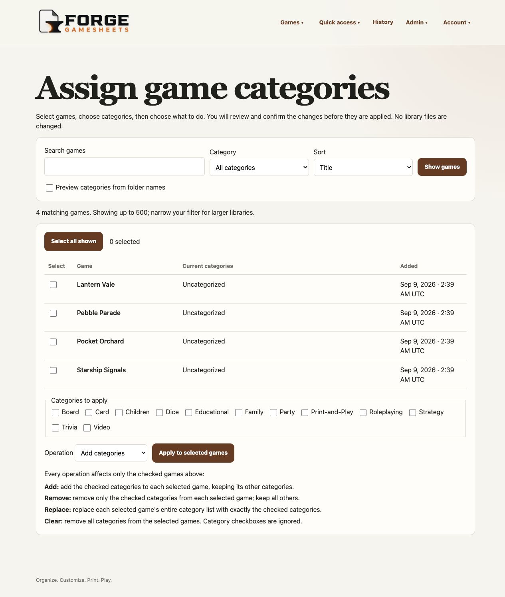
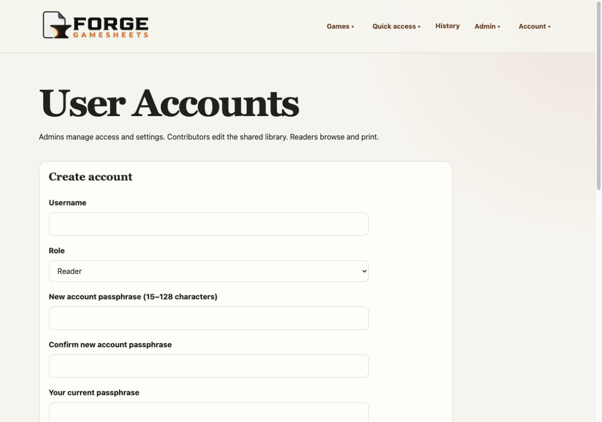
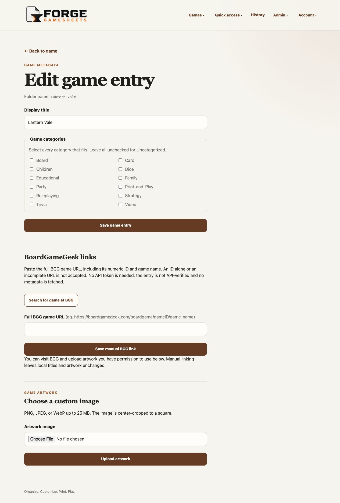
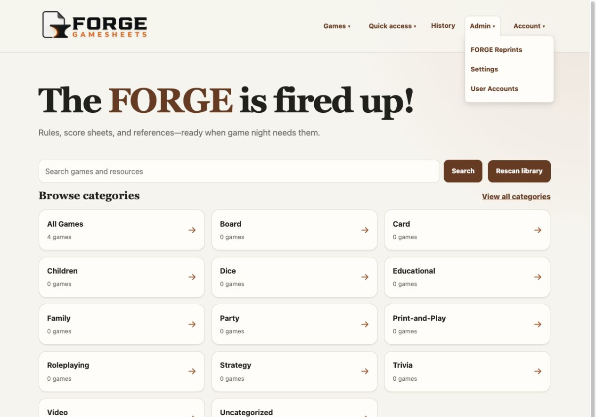

<p align="center">
  
</p>

# Forge GameSheets

**Organize. Customize. Print. Play.**

Forge GameSheets is a self-hosted library for board-game rules, score sheets,
player references, and other printable PDF resources. It scans ordinary folders
on disk and provides a responsive browser interface for organizing, finding,
viewing, downloading, and printing those files.

FORGE GAMESHEETS is in beta, with local library management and optional
FORGE Reprints available. Core operation does not modify source PDFs, require
a cloud service, or store PDF contents in its database.

## Available features

- Recursive PDF discovery beneath one first-level folder per game
- Forgiving filename parsing and document-type recognition
- Search across game and resource titles
- Browser viewing, descriptive download filenames, and first-page PDF previews
- Optional FORGE Reprint copies with a QR return link and source-rights notice
- Editable display titles, document metadata, and game artwork
- Multiple customizable categories per game
- Bulk category assignment with filtering, selection, and confirmation before changes
- Optional trailing folder-category hints, such as `Yahtzee [Dice, Children]`
- Optional local Admin, Contributor, and Reader accounts with revocable QR guest links
- Token-free manual BGG game URLs, Game/Files links, and external title search
- All Games, category, and Uncategorized browsing
- Favorites, up to ten pinned homepage resources, Recent, and use history
- Configurable library footer, Recent limit, and History time zone
- Manual rescans with safe partial-scan and missing-file behavior
- Grouped desktop dropdowns and a compact-screen hamburger menu
- SQLite migrations that preserve application state across restarts
- GitHub-published container images with revision and build-date information

The approved scope and roadmap are in [PROJECT_PLAN.md](PROJECT_PLAN.md).

## Screenshots

Screenshots refreshed September 4, 2026, using an invented demonstration library
and demo accounts. No private library content or third-party game files are
included. These views show authentication enabled; available controls depend on
the signed-in role. Click an image to inspect it at full size.

| Library and categories | Game resources |
| --- | --- |
|  |  |
| **Bulk game categories** | **FORGE Reprint** |
|  |  |
| **Settings and folder-category import** | **Accounts and QR access** |
|  |  |
| **Manual BoardGameGeek linking** | **Integration and build details** |
|  |  |
| **Grouped desktop navigation** | **Mobile navigation** |
|  |  |

The [screenshot maintenance guide](docs/SCREENSHOTS.md) records the capture
procedure and review requirements.

## Requirements

Published images only receive source changes after the corresponding commit
passes the publication checks.

- Docker Desktop or another Docker installation with Compose support
- A local directory containing the PDF library
- A separate writable directory for Forge GameSheets application data

The included `compose.yml` uses the repository's `library/` and `data/`
directories and binds the application only to `127.0.0.1:8000`.

For a persistent Docker-host installation, access-model guidance, upgrades,
backups, and troubleshooting, follow the
[self-hosted beta deployment guide](docs/deployment.md).

## Quick start

Run these commands on the Docker host where FORGE will run. Obtain the
repository once to get `compose.yml` and the example configuration:

```sh
git clone https://github.com/natsteff/forge-gamesheets.git
cd forge-gamesheets
cp .env.example .env
mkdir -p data library
```

Keep host-specific configuration in `.env`, not `compose.yml`. On Linux,
make `data/` writable by the container's `10001:10001` account before starting;
see the [deployment guide](docs/deployment.md). Docker Desktop usually handles
this through file sharing.

1. Put game folders inside `library/`, optionally including local game artwork:

   ```text
   library/
   ├── Farkle/
   │   ├── Farkle - Rules.pdf
   │   ├── Farkle - Score Sheet.pdf
   │   └── icon.png
   └── Yahtzee/
       ├── Yahtzee - Score Sheet.pdf
       └── cover.jpg
   ```

   Images are optional: use `icon` or `cover` with a PNG, JPEG, or WebP
   extension in the game folder. You can also upload artwork later through
   **Edit game entry**. No game PDFs or artwork are bundled with FORGE.

   Optional category hints go at the end of the **game folder name**:
   `Yahtzee [Dice]`, `Yahtzee [Dice, Children]`, or
   `Yahtzee (Family Favorite) [Dice, Children]`. Commas separate categories;
   parentheses remain part of the game title. Missing categories are created
   when hints are applied. PDF filenames do not need the category suffix.

2. Pull the prebuilt image from GitHub Container Registry and start it:

   ```sh
   docker compose pull
   docker compose up -d
   ```

3. Open <http://localhost:8000> on that host. For another device on your trusted
   LAN, configure the bind address and host URL as described below.

   Category import is **off by default**. To use hints for future imports, enable
   **Settings → Library scanning → Import game categories from folder names**
   before adding new game folders, then select **Rescan library**. With accounts
   enabled, this setting requires an Admin.

   Games already discovered on the first startup are not retroactively changed
   by enabling the setting. Use **Games → Assign game categories**, check
   **Preview categories from folder names**, select **Show games**, then select
   the games and apply the folder hints after reviewing the confirmation.
   This adds categories without changing existing titles or removing manual
   assignments. See [game category guidance](docs/GAME_CATEGORIES.md).

4. Stop the application when needed with `docker compose down`.

The health endpoint is available at <http://localhost:8000/health>. No local
image build is required. The default `main` image tracks development; it is not
a stable-release designation.

## Self-hosted beta configuration

The Compose defaults are intentionally local and use the repository's `data/`
and `library/` directories. To override them, copy `.env.example` to `.env` and
change only the values needed for the host:

| Setting | Default | Purpose |
| --- | --- | --- |
| `FORGE_GAMESHEETS_BIND_ADDRESS` | `127.0.0.1` | Host address that accepts connections |
| `FORGE_GAMESHEETS_PORT` | `8000` | Host port used to open Forge |
| `FORGE_GAMESHEETS_BASE_URL` | unset | Address encoded into FORGE Reprint QR links |
| `FORGE_GAMESHEETS_DATA_PATH` | `./data` | Writable application state |
| `FORGE_GAMESHEETS_LIBRARY_PATH` | `./library` | Source PDF library, mounted read-only |
| `FORGE_GAMESHEETS_IMAGE_TAG` | `main` | Published image channel or fixed release tag |

Published images already include their release, revision, and UTC build date,
visible in Settings and `/health`; users do not need to configure these values.

### Published image deployment

Normal Docker-host installations use the image published from GitHub. Keep
`FORGE_GAMESHEETS_IMAGE_TAG=main` in `.env` for current development builds, or
select a version tag for a fixed release when one is available. Update with:

```sh
docker compose pull
docker compose up -d
```

Do not add host-specific settings to `compose.yml`; keep them in `.env`.

On a Linux Docker host using the default bind mount, prepare the data directory
for Forge's fixed non-root container identity before the first start:

```sh
sudo chown -R 10001:10001 data
```

Do not apply that ownership change to the source PDF library. It only needs to
be readable by the container. Docker Desktop for macOS and Windows normally
handles bind-mount permissions through its file-sharing layer.

For access from another device on a trusted private LAN, set
`FORGE_GAMESHEETS_BIND_ADDRESS=0.0.0.0` in `.env`, then open the configured port
on the Docker host. Authentication is off until local Admin setup: never expose that
port directly to the public Internet or an untrusted network. Remote access
requires an appropriate authenticated proxy, VPN, or network access-control
layer.

After a detached start, allow initialization to finish and verify readiness:

```sh
docker compose ps
curl --retry 10 --retry-all-errors --retry-delay 1 \
  http://127.0.0.1:8000/health
```

## Organizing files

Each first-level directory inside `library/` represents one game. PDFs can be
nested beneath that game directory. The preferred filename is:

```text
<Game Name> - <Document Type> [optional variant].pdf
```

Names do not need to be perfect. Unrecognized PDFs remain accessible under
Other, and display metadata can be corrected in the interface without renaming
the source file. Select **Rescan library** after changing library contents.

Optional game artwork can be placed at the top of a game folder using the name
`icon` or `cover` and a PNG, JPEG, or WebP extension. Artwork can also be
uploaded through **Edit game entry**.

### Game categories and folder hints

Use **Games → Assign game categories** to search/filter games and add, remove,
replace, or clear categories for up to 500 selected games per batch. Every action
shows a confirmation summary before changing data. Admins and Contributors can
use it; Readers cannot edit categories.

Admins can enable **Settings → Library scanning → Import game categories from
folder names** (off by default). A folder such as `Yahtzee (Family) [Dice, Children]`
imports the display title `Yahtzee (Family)` with two categories. Missing categories
are created; parentheses remain title text. This setting affects newly discovered
games only. Existing games require the assignment page's explicit folder-hint
preview and additive application. Rescans preserve manual assignments, and no
folders or source files are renamed. See [category guidance](docs/GAME_CATEGORIES.md).

### BoardGameGeek links without a token

In **Edit game entry**, paste a full BGG game URL containing both its numeric ID
and game-name slug. Forge stores the manual association without fetching or
verifying metadata. Linked games show **View on BGG** and **BGG Files**; unlinked
games show **Search for game at BGG**, using the local display title in a new tab.
Bare IDs and incomplete URLs are not accepted. Local titles and artwork stay
unchanged. See [manual BGG links](docs/BGG_MANUAL_LINKS.md).

You can upload artwork you have permission to use through the existing image
upload. Manual links do not scrape BGG or automatically download images or PDFs.
API enrichment remains a separate, optional feature requiring token configuration.

### Navigation

Desktop navigation groups **Games** (All games, Categories, Assign game categories),
**Quick access** (Pinned, Favorites, Recently used), and **Account** (permitted
account/settings/user actions), with **History** separate. The logo opens Library
home. Mobile Menu shows the same groups with visible links. Users is shown only
to signed-in Admins; editing options follow role permissions. Recently used is
hidden when its configured limit is zero.

## Application data and backups

The source PDFs remain in `library/`. The `data/` directory contains the SQLite
database, uploaded artwork, and regenerable caches. Back up both directories:

- `library/` preserves original PDFs and detected artwork.
- `data/` preserves titles, categories, favorites, pins, settings, activity,
  uploaded artwork, accounts, sessions, and QR sharing state. Preserve the hidden
  `.authentication-required` marker with the rest of this directory.

Stop the application before making a simple filesystem copy of `data/`. See
[Backup and recovery](docs/BACKUP_AND_RECOVERY.md) before upgrades or migration.

## Security boundary

FORGE supports optional local Admin, Contributor, and Reader accounts. Existing
installations remain in trusted-operator mode until the operator explicitly
creates the first Admin from a local terminal. An upgrade does not activate
login or change source-library permissions.

### Enable accounts

If Forge will be opened from another device, configure and test its final HTTPS
reverse-proxy address **before** enabling accounts. The deployment guide includes
a tested [Nginx Proxy Manager setup](docs/deployment.md#https-with-nginx-proxy-manager),
including private/self-signed certificates and trusted forwarded headers. Direct
LAN HTTP login is deliberately rejected; localhost HTTP remains supported.

Start the current Forge container, then open a terminal **on its Docker host**.
From the directory containing that installation's `compose.yml`, run:

```sh
docker compose exec app python -m app.accounts create-admin
```

Enter the first Admin username and a new 15–128-character passphrase at the
private prompts. Do not put the passphrase in the command. Successful setup
immediately requires sign-in for the existing library; it does not change PDFs,
categories, or other content. Sign in with that Admin, then open **Account →
Users** to create Contributor or Reader accounts and configure QR guest access.
There is no default password or web-based initial setup.

Read [Accounts and QR sharing](docs/ACCOUNTS.md) before activation for HTTPS
requirements, role permissions, recovery, backups, and the effect on previously
printed QR codes. If the container is not running or has a different Compose
service name, follow the deployment-specific instructions instead of changing
the database manually.

For upgrades, `docker compose pull` updates the image only. First update the
repository deployment files and review new `.env.example` options by following
the [existing-installation upgrade procedure](docs/deployment.md#update-an-existing-installation).

The supplied Compose file listens only on localhost. Non-local sign-in requires
HTTPS through a correctly configured proxy. Accounts are not a substitute for
network protection or approval for direct public exposure; do not expose Forge
directly to the Internet.

The library mount is read-only. Forge GameSheets never edits source PDFs.

- **Trusted-operator mode:** until accounts are activated, anyone who can reach
  the application can edit it. Restrict network access before starting.
- **Accounts:** passwords use salted Argon2id hashes, not plaintext. New passwords
  receive offline common-password screening. Sessions expire and account changes
  invalidate affected sessions. These controls do not make public exposure safe.
- **QR sharing:** secure guest links are bearer credentials. Anyone with a link
  can access that resource while guest sharing is allowed; keep printed copies
  and links private when appropriate. Admins can revoke links or require Reader
  sign-in. Old numeric QR links require login after activation. Downloaded copies
  cannot be revoked.
- **Host and backups:** the database is not encrypted by Forge. Protect data,
  backups, activation markers, and BGG tokens. A container is not a complete
  security boundary; keep the host and images updated.
- **Content:** PDF/image parsing is not malware scanning. Only add trusted files
  you are authorized to use. Browser PDF viewers also need updates. PDF upload
  from the web UI is not implemented; artwork upload is available to editors.
- **Audit visibility:** Admins can review recent account/sharing security events
  with actor and target names. This is bounded activity logging, not a complete
  audit trail. Protect proxy logs as they may contain sharing URLs.

Implementation review and publication safeguards are described separately in
[Development and security](#development-and-security).

## Content rights and responsibility

Forge GameSheets is self-hosted software. It does not provide, sell, upload,
verify the safety or rights of the PDFs placed in an operator's library. The library
operator controls those files and is responsible for ensuring that their
storage, reproduction, use, printing, and distribution are permitted by the
rights holder, applicable license terms, public-domain status, or applicable
law.

The FORGE GAMESHEETS mark on a generated reprint identifies the software used
to prepare that copy. It does not claim authorship or ownership of the source
content and does not imply affiliation with or endorsement by its rights
holders. A FORGE Reprint does not itself grant permission to reproduce or
distribute a source PDF.

QR links point back to the operator's own Forge installation. Depending on its
network configuration, that link may make a resource reachable from other
devices. With accounts enabled, numeric QR links require sign-in; an Admin can
explicitly create a revocable, resource-scoped guest link instead. Anyone with
that link can access the shared resource while guest access is allowed. Disabling
guest access requires Reader-or-higher sign-in, but cannot recall downloaded copies.
Use the original PDF when a copy without a FORGE sharing link is desired.

## Testing and development

Developers working from local source (including on macOS) build instead of
pulling the published image. The project build command automatically embeds
the checked-out Git revision and current UTC date:

```sh
./scripts/build
docker compose up -d
```

Build identity overrides for release tooling are `FORGE_GAMESHEETS_VERSION`,
`FORGE_GAMESHEETS_REVISION`, and `FORGE_GAMESHEETS_BUILD_DATE`. They affect image
builds, not the identity of an already-published image.

The build script selects the development image, which includes test tools.
Published images use the smaller runtime stage and do not include those tools.
Run the automated checks in the locally built development container:

```sh
docker compose run --rm app pytest
docker compose run --rm app ruff check .
```

Developer workflow details are in [docs/DEVELOPMENT.md](docs/DEVELOPMENT.md).
Beta testers should follow [docs/BETA_TESTING.md](docs/BETA_TESTING.md).

## Current limitations

- Printing is handled by the browser's PDF viewer; the application cannot
  reliably detect whether a print completed.
- PDF previews show only the first page and may be unavailable for malformed or
  unsupported PDFs.
- Preview and FORGE Reprint processing supports source PDFs up to 250 MB, 500
  pages, and 200 inches in either page dimension. Larger source PDFs remain
  available for original viewing and download but are not processed.
- Game artwork is limited to 25 MB and 40 megapixels before normalization.
  Submissions have a 26 MiB total request limit (including form overhead), a
  30-second receive timeout, and at most four concurrent submissions per process.
- PDF rendering is serialized. Reprints are capped at 250 MiB and previews at
  1 MiB; their combined managed storage budget is 5 GiB. New rendering requires
  free space for the maximum output plus 100 MiB of headroom. Existing copies
  remain usable when those limits prevent new generation.
- FORGE Reprint creates a marked derived copy but does not edit, combine, or
  replace source PDFs.
- Game folders must currently be first-level children of the library root.
- Manual BGG links and external search work without a token. API enrichment is
  experimental and its rollout remains on hold pending approval and token
  distribution guidance. No token is bundled. Configuring one does not verify
  approval or API access; without it, only API controls are unavailable.
- Automatic BGG scan matching and artwork fallback are not yet implemented.
- Structured FGS files, an editor, and a renderer remain future work.
- There is no remote synchronization or cloud backup.
- Production deployment and public network exposure have not been approved.

See the [Phase 1.5 external beta release checklist](docs/PHASE1_5_RELEASE_CHECKLIST.md)
for current prerelease readiness, the
[Phase 1.5 beta release notes](docs/PHASE1_5_BETA_RELEASE_NOTES.md) for the
next prerelease summary, the historical
[Phase 1 release checklist](docs/PHASE1_RELEASE_CHECKLIST.md),
[beta release notes](docs/PHASE1_BETA_RELEASE_NOTES.md) for the timeline-free
Phase 1 summary, and
[browser PDF printing](docs/decisions/001-browser-pdf-printing.md) for the
print-history decision.

## Development and security

FORGE GAMESHEETS is developed with assistance from OpenAI Codex, guided by a
maintainer with professional experience in software test management and
security roles. Development includes automated testing and incremental
changes, with OWASP ASVS-based security reviews planned for major releases.
The source is openly available for inspection and contributions.

Before publishing Docker images, [GitHub Actions](.github/workflows/publish-container.yml)
runs automated tests, code-quality checks, and dependency vulnerability audits.
Dependency audit findings block publication. Container scans report High and
Critical findings and block publication for Critical vulnerabilities with an
available fix. The workflow publishes the same image that passed these checks.

These safeguards complement—not replace—code review, targeted security testing,
and planned OWASP ASVS-based reviews for major releases. Passing checks is not a
security certification or a guarantee that no vulnerabilities exist.

Documentation checks run with the test suite to catch broken local references,
missing screenshot files, and selected stale feature claims. Major updates also
require a critical-path documentation and screenshot review; automated checks
cannot establish that instructions or screenshots accurately describe every
workflow. See [documentation review](docs/DOCUMENTATION_REVIEW.md).

Operator responsibilities and deployment precautions are described in
[Security boundary](#security-boundary), separate from the development checks above.

Security is a shared responsibility: maintainers work to improve application
safety, while operators manage secure deployment, updates, access, and library
content. Testing and review reduce risk but cannot guarantee security.

## License

Forge GameSheets is available under the [MIT License](LICENSE).
