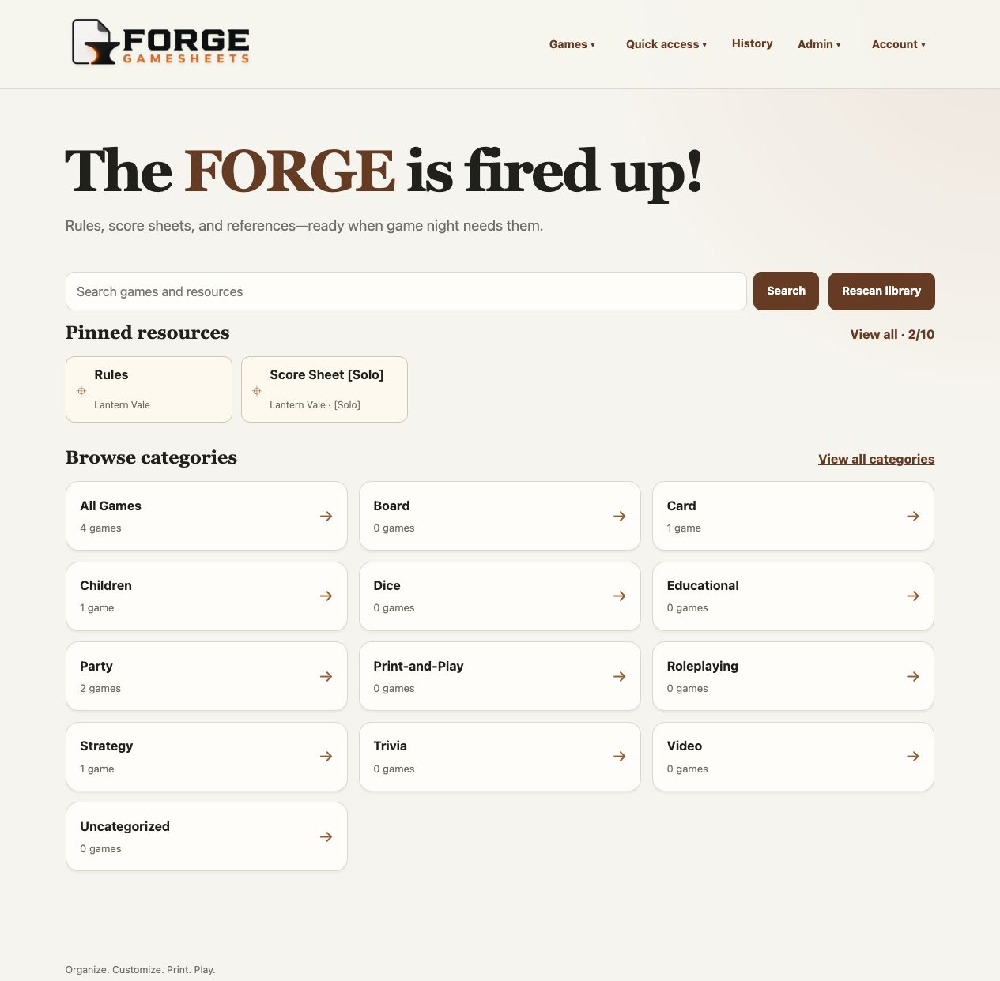
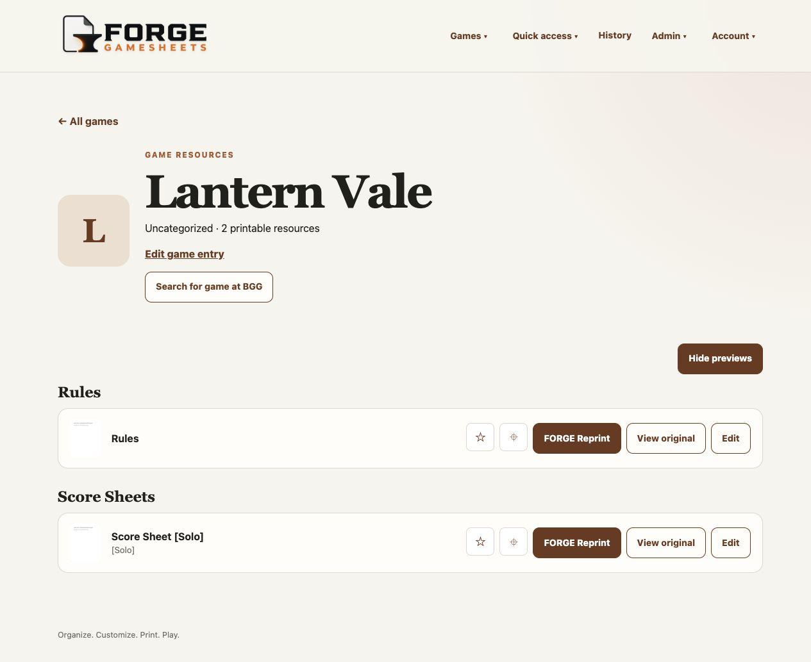
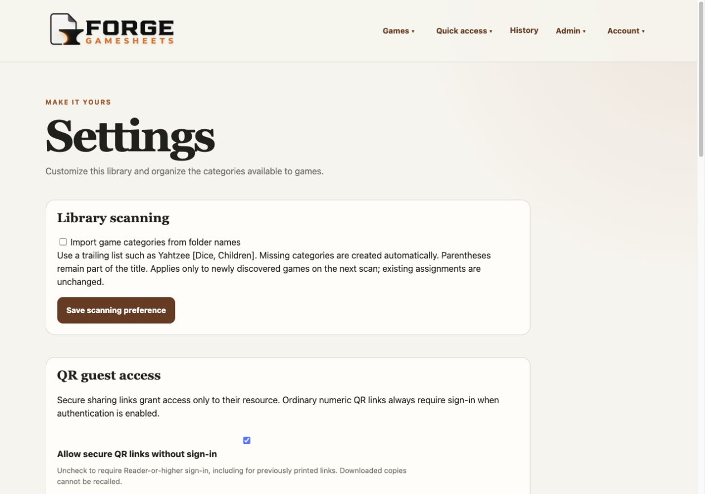
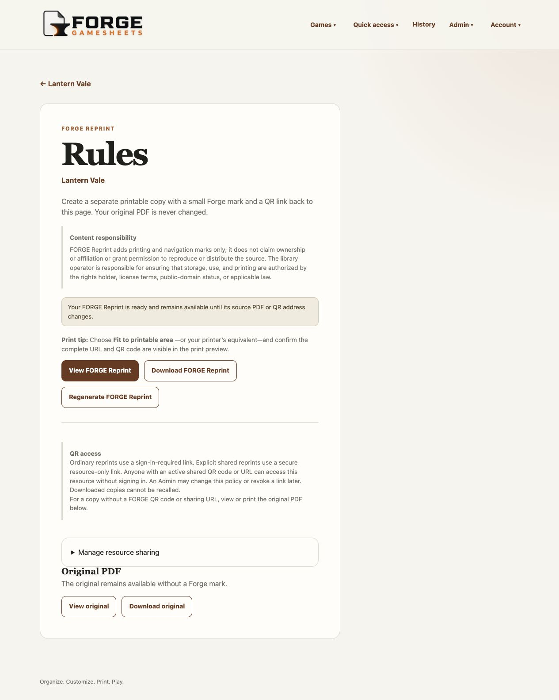
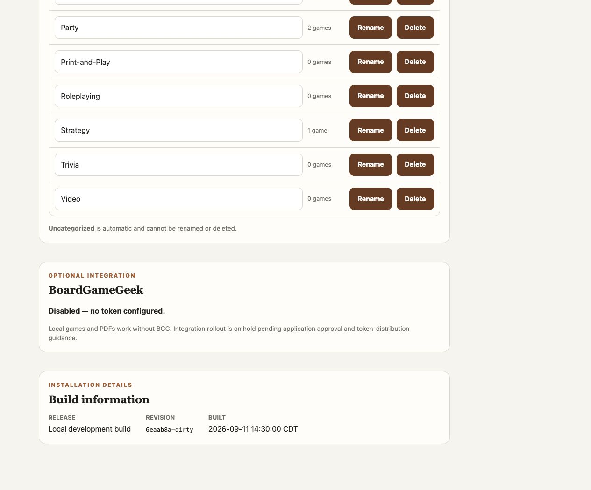
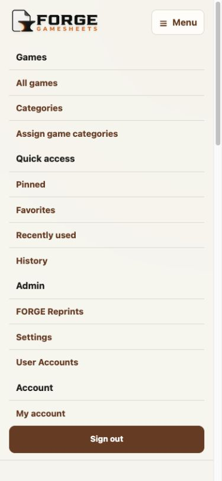

<p align="center">
  
</p>

# Forge GameSheets

**Organize. Customize. Print. Play.**

Forge GameSheets is a self-hosted library for board-game rules, score sheets,
player references, and other printable PDF resources. It scans ordinary folders
on disk and provides a responsive browser interface for organizing, finding,
viewing, downloading, and printing those files.

FORGE GAMESHEETS is in beta, with local library management and optional
FORGE Reprints available. Core operation does not modify source PDFs, require
a cloud service, or store PDF contents in its database.

## Available features

- Recursive PDF discovery beneath one first-level folder per game
- Forgiving filename parsing and document-type recognition
- Search across game and resource titles
- Browser viewing, descriptive download filenames, and first-page PDF previews
- Optional FORGE Reprint copies with a QR return link and source-rights notice
- Editable display titles, document metadata, and game artwork
- Multiple customizable categories per game
- All Games, category, and Uncategorized browsing
- Favorites, up to ten pinned homepage resources, Recent, and use history
- Configurable library footer, Recent limit, and History time zone
- Manual rescans with safe partial-scan and missing-file behavior
- Responsive, keyboard-accessible pages with a compact-screen navigation menu
- SQLite migrations that preserve application state across restarts
- GitHub-published container images with revision and build-date information

The approved scope and roadmap are in [PROJECT_PLAN.md](PROJECT_PLAN.md).

## Screenshots

All screenshots use an invented demonstration library; no private or
copyrighted game files are included.

| Library and categories | Game resources |
| --- | --- |
|  |  |
| **Settings** | **FORGE Reprint** |
|  |  |
| **Integration and build details** | **Mobile navigation** |
|  |  |

## Requirements

- Docker Desktop or another Docker installation with Compose support
- A local directory containing the PDF library
- A separate writable directory for Forge GameSheets application data

The included `compose.yml` uses the repository's `library/` and `data/`
directories and binds the application only to `127.0.0.1:8000`.

For a persistent Docker-host installation, access-model guidance, upgrades,
backups, and troubleshooting, follow the
[self-hosted beta deployment guide](docs/deployment.md).

## Quick start

Run these commands on the Docker host where FORGE will run. Obtain the
repository once to get `compose.yml` and the example configuration:

```sh
git clone https://github.com/natsteff/forge-gamesheets.git
cd forge-gamesheets
cp .env.example .env
mkdir -p data library
```

Keep host-specific configuration in `.env`, not `compose.yml`. On Linux,
make `data/` writable by the container's `10001:10001` account before starting;
see the [deployment guide](docs/deployment.md). Docker Desktop usually handles
this through file sharing.

1. Put game folders inside `library/`, optionally including local game artwork:

   ```text
   library/
   ├── Farkle/
   │   ├── Farkle - Rules.pdf
   │   ├── Farkle - Score Sheet.pdf
   │   └── icon.png
   └── Yahtzee/
       ├── Yahtzee - Score Sheet.pdf
       └── cover.jpg
   ```

   Images are optional: use `icon` or `cover` with a PNG, JPEG, or WebP
   extension in the game folder. You can also upload artwork later through
   **Edit game entry**. No game PDFs or artwork are bundled with FORGE.

2. Pull the prebuilt image from GitHub Container Registry and start it:

   ```sh
   docker compose pull
   docker compose up -d
   ```

3. Open <http://localhost:8000> on that host. For another device on your trusted
   LAN, configure the bind address and host URL as described below.

4. Stop the application when needed with `docker compose down`.

The health endpoint is available at <http://localhost:8000/health>. No local
image build is required. The default `main` image tracks development; it is not
a stable-release designation.

## Self-hosted beta configuration

The Compose defaults are intentionally local and use the repository's `data/`
and `library/` directories. To override them, copy `.env.example` to `.env` and
change only the values needed for the host:

| Setting | Default | Purpose |
| --- | --- | --- |
| `FORGE_GAMESHEETS_BIND_ADDRESS` | `127.0.0.1` | Host address that accepts connections |
| `FORGE_GAMESHEETS_PORT` | `8000` | Host port used to open Forge |
| `FORGE_GAMESHEETS_BASE_URL` | unset | Address encoded into FORGE Reprint QR links |
| `FORGE_GAMESHEETS_DATA_PATH` | `./data` | Writable application state |
| `FORGE_GAMESHEETS_LIBRARY_PATH` | `./library` | Source PDF library, mounted read-only |
| `FORGE_GAMESHEETS_IMAGE_TAG` | `main` | Published image channel or fixed release tag |

Published images already include their release, revision, and UTC build date,
visible in Settings and `/health`; users do not need to configure these values.

### Published image deployment

Normal Docker-host installations use the image published from GitHub. Keep
`FORGE_GAMESHEETS_IMAGE_TAG=main` in `.env` for current development builds, or
select a version tag for a fixed release when one is available. Update with:

```sh
docker compose pull
docker compose up -d
```

Do not add host-specific settings to `compose.yml`; keep them in `.env`.

On a Linux Docker host using the default bind mount, prepare the data directory
for Forge's fixed non-root container identity before the first start:

```sh
sudo chown -R 10001:10001 data
```

Do not apply that ownership change to the source PDF library. It only needs to
be readable by the container. Docker Desktop for macOS and Windows normally
handles bind-mount permissions through its file-sharing layer.

For access from another device on a trusted private LAN, set
`FORGE_GAMESHEETS_BIND_ADDRESS=0.0.0.0` in `.env`, then open the configured port
on the Docker host. Forge has no built-in authentication: never expose that
port directly to the public Internet or an untrusted network. Remote access
requires an appropriate authenticated proxy, VPN, or network access-control
layer.

After a detached start, allow initialization to finish and verify readiness:

```sh
docker compose ps
curl --retry 10 --retry-all-errors --retry-delay 1 \
  http://127.0.0.1:8000/health
```

## Organizing files

Each first-level directory inside `library/` represents one game. PDFs can be
nested beneath that game directory. The preferred filename is:

```text
<Game Name> - <Document Type> [optional variant].pdf
```

Names do not need to be perfect. Unrecognized PDFs remain accessible under
Other, and display metadata can be corrected in the interface without renaming
the source file. Select **Rescan library** after changing library contents.

Optional game artwork can be placed at the top of a game folder using the name
`icon` or `cover` and a PNG, JPEG, or WebP extension. Artwork can also be
uploaded through **Edit game entry**.

## Application data and backups

The source PDFs remain in `library/`. The `data/` directory contains the SQLite
database, uploaded artwork, and regenerable caches. Back up both directories:

- `library/` preserves original PDFs and detected artwork.
- `data/` preserves titles, categories, favorites, pins, settings, activity,
  and uploaded artwork.

Stop the application before making a simple filesystem copy of `data/`. See
[Backup and recovery](docs/BACKUP_AND_RECOVERY.md) before upgrades or migration.

## Security boundary

FORGE has no authentication or user accounts. The supplied Compose file is
intended for local beta use and listens only on localhost. Do not expose it to
the internet or an untrusted network without an intentionally designed access
and authentication layer.

The library mount is read-only. Forge GameSheets never edits source PDFs.

## Content rights and responsibility

Forge GameSheets is self-hosted software. It does not provide, sell, upload,
inspect, or verify the PDFs placed in an operator's library. The library
operator controls those files and is responsible for ensuring that their
storage, reproduction, use, printing, and distribution are permitted by the
rights holder, applicable license terms, public-domain status, or applicable
law.

The FORGE GAMESHEETS mark on a generated reprint identifies the software used
to prepare that copy. It does not claim authorship or ownership of the source
content and does not imply affiliation with or endorsement by its rights
holders. A FORGE Reprint does not itself grant permission to reproduce or
distribute a source PDF.

QR links point back to the operator's own Forge installation. Depending on its
network configuration, that link may make a resource reachable from other
devices. Forge has no built-in authentication, so operators must not expose
protected resources directly to the public internet or an untrusted network.

## Testing and development

Developers working from local source (including on macOS) build instead of
pulling the published image. The project build command automatically embeds
the checked-out Git revision and current UTC date:

```sh
./scripts/build
docker compose up -d
```

Build identity overrides for release tooling are `FORGE_GAMESHEETS_VERSION`,
`FORGE_GAMESHEETS_REVISION`, and `FORGE_GAMESHEETS_BUILD_DATE`. They affect image
builds, not the identity of an already-published image.

The build script selects the development image, which includes test tools.
Published images use the smaller runtime stage and do not include those tools.
Run the automated checks in the locally built development container:

```sh
docker compose run --rm app pytest
docker compose run --rm app ruff check .
```

Developer workflow details are in [docs/DEVELOPMENT.md](docs/DEVELOPMENT.md).
Beta testers should follow [docs/BETA_TESTING.md](docs/BETA_TESTING.md).

## Current limitations

- Printing is handled by the browser's PDF viewer; the application cannot
  reliably detect whether a print completed.
- PDF previews show only the first page and may be unavailable for malformed or
  unsupported PDFs.
- Preview and FORGE Reprint processing supports source PDFs up to 250 MB, 500
  pages, and 200 inches in either page dimension. Larger source PDFs remain
  available for original viewing and download but are not processed.
- Game artwork is limited to 25 MB and 40 megapixels before normalization.
  Submissions have a 26 MiB total request limit (including form overhead), a
  30-second receive timeout, and at most four concurrent submissions per process.
- PDF rendering is serialized. Reprints are capped at 250 MiB and previews at
  1 MiB; their combined managed storage budget is 5 GiB. New rendering requires
  free space for the maximum output plus 100 MiB of headroom. Existing copies
  remain usable when those limits prevent new generation.
- FORGE Reprint creates a marked derived copy but does not edit, combine, or
  replace source PDFs.
- Game folders must currently be first-level children of the library root.
- BoardGameGeek integration is experimental. Its client, saved associations,
  and manual matching workflow exist, but further development and public
  rollout are on hold pending application approval and token-distribution
  guidance. No token is bundled; normal local use does not require BGG.
  Without a token, BGG game controls are hidden and Settings shows the disabled
  status. Configuring a token does not itself verify approval or API access.
- Automatic BGG scan matching and artwork fallback are not yet implemented.
- Structured FGS files, an editor, and a renderer remain future work.
- There is no remote synchronization or cloud backup.
- Production deployment and public network exposure have not been approved.

See the [Phase 1.5 external beta release checklist](docs/PHASE1_5_RELEASE_CHECKLIST.md)
for current prerelease readiness, the
[Phase 1.5 beta release notes](docs/PHASE1_5_BETA_RELEASE_NOTES.md) for the
next prerelease summary, the historical
[Phase 1 release checklist](docs/PHASE1_RELEASE_CHECKLIST.md),
[beta release notes](docs/PHASE1_BETA_RELEASE_NOTES.md) for the timeline-free
Phase 1 summary, and
[browser PDF printing](docs/decisions/001-browser-pdf-printing.md) for the
print-history decision.

## Development and security

FORGE GAMESHEETS is developed with assistance from OpenAI Codex, guided by a
maintainer with professional experience in software test management and
security roles. Development includes automated testing and incremental
changes, with OWASP ASVS-based security reviews planned for major releases.
The source is openly available for inspection and contributions.

FORGE is designed for self-hosted use on localhost or a trusted private
network. For remote access, use a VPN or an appropriately secured,
authenticated reverse proxy rather than exposing the application directly to
the Internet. Docker provides isolation, but is not a complete security
boundary.

Security is a shared responsibility: maintainers work to improve application
safety, while operators manage secure deployment, updates, access, and library
content. Testing and review reduce risk but cannot guarantee security.

## License

Forge GameSheets is available under the [MIT License](LICENSE).
