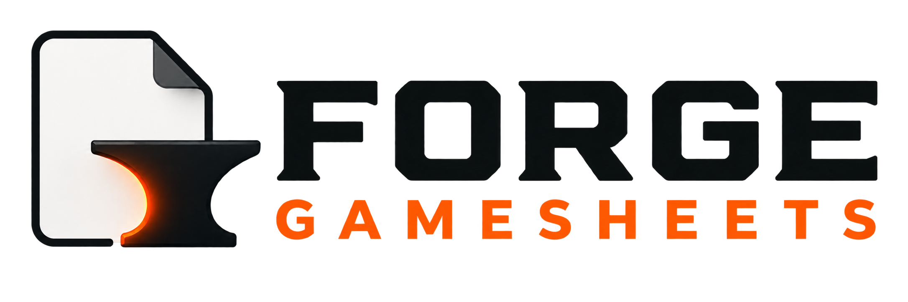

  

# FORGE GameSheets

**Collect. Create. Print. Play. Or Go Live with LiveSheets.**

FORGE GameSheets is a self-hosted home for printable game resources, custom
GameSheets, and temporary live scoring. Organize and search PDF rulebooks,
score sheets, player aids, and print-and-play files; design new structured
sheets; and share compatible sheets as interactive LiveSheets across devices.
Source PDFs remain yours and are not modified by the application.

Want to create and export GameSheets without installing the full application?
[FGS Studio](https://natsteff.github.io/FGS-Studio/) provides the browser-only
Sheet Designer.

FORGE GameSheets is in **beta**. It is developed with careful and responsible
AI assistance under human maintainer direction, supported by automated
testing and security checks. See [Development and security](#development-and-security)
for details.

Looking for a TTRPG character-sheet builder? [FORGE TTRPG](https://forge-ttrpg.vercel.app/app/templates)
is a separate, similarly named tool offering character-sheet templates and
features outside the scope of FORGE GameSheets. It may be useful to FGS users,
but it is not part of FORGE GameSheets.

## What you can do

- **Collect and find:** Browse a filesystem-based PDF library by game and
  category, search resources, and open original files without changing them.
- **Create and print:** Build portable FGS GameSheets with a live preview, then
  export a PDF or `.fgs` source. Design full sheets, half sheets, or cards and
  arrange smaller copies on printer paper with cut guides.
- **Play live:** Start temporary single-scorer or individual-scoring LiveSheets
  from compatible saved sheets. Scores update across devices without changing
  the reusable FGS source.
- **Manage a collection:** Add game links and artwork, optional BoardGameGeek
  associations, and derived Reprint copies with a QR return link. Local
  accounts, backups, and metadata portability support shared installations.

Explore the [workflow guide](docs/LIBRARY_GUIDE.md),
[Sheet Designer and LiveSheets guide](docs/SHEET_DESIGNER.md), and
[complete screenshot gallery](docs/SCREENSHOT_GALLERY.md) for more detail.

## Screenshots

The [screenshot gallery](docs/SCREENSHOT_GALLERY.md) retains the library,
resources, categories, Reprint maintenance, accounts, history, settings,
Designer, and BoardGameGeek views. Older captures are labeled as earlier
interfaces rather than presented as current. This active LiveSheet was
captured from a disposable fictional demo; its invitation is inactive and the
**qr code here** placeholder is not scannable.

## Get started

Use the [self-hosted beta deployment guide](docs/deployment.md) for the
installation, configuration, and update steps. It covers Docker Compose,
library and data directories, permissions, trusted-LAN access, and backups.
You need Docker with Compose, a directory of your own PDFs, and a separate
writable application-data directory. No game PDFs are bundled.

Docker installations are intended for an **individual workstation or a trusted
private LAN**, not direct exposure to the public Internet. The default Compose
configuration binds to localhost. Review the
[security boundary](docs/ACCOUNTS.md) before enabling accounts or access from
other devices.

If you are trying only the Designer, the browser-only
[FGS Studio](https://natsteff.github.io/FGS-Studio/) needs no FORGE GameSheets container.
The published container also has an optional Designer-only mode; see the
[Designer guide](docs/SHEET_DESIGNER.md#scope-and-designer-only-mode).

## Documentation

| Need | Guide |
| --- | --- |
| Install, configure, update, or troubleshoot | [Self-hosted deployment](docs/deployment.md) |
| Organize PDFs, game links, and Reprints | [PDF library workflows](docs/LIBRARY_GUIDE.md) |
| Create sheets, print smaller sizes, or start LiveSheets | [Sheet Designer and LiveSheets](docs/SHEET_DESIGNER.md) · [Finished-size printing](docs/PRINT_SIZE_PRINTING.md) |
| Understand the current FGS format | [FGS 1.3 format and version history](docs/FGS_FORMAT.md) |
| Browse every screenshot | [Screenshot gallery](docs/SCREENSHOT_GALLERY.md) |
| Enable local accounts or plan backups | [Accounts and QR access](docs/ACCOUNTS.md) · [Backup and recovery](docs/BACKUP_AND_RECOVERY.md) |
| Develop or test from source | [Development guide](docs/DEVELOPMENT.md) · [Beta testing](docs/BETA_TESTING.md) |
| Review roadmap and release readiness | [Project plan](PROJECT_PLAN.md) · [Beta release checklist](docs/PHASE1_5_RELEASE_CHECKLIST.md) |

The [FGS format index](docs/FGS_FORMAT.md) links the cumulative 1.0–1.3
specifications, JSON Schemas, rendering profiles, and renderer source. The 1.3
additions document alone is not the entire specification.

## Current boundaries

Sheet Designer creates structured new sheets; it does not edit existing PDFs,
provide arbitrary free-positioned page layout, or automatically paginate
multi-page output. Finished size is currently selected for preview/export and
is not saved in `.fgs`. See the [Designer guide](docs/SHEET_DESIGNER.md) and
[current FGS format](docs/FGS_FORMAT.md) for details.

The application does not include cloud synchronization or backup. Back up
both your source library and writable application data; see
[Backup and recovery](docs/BACKUP_AND_RECOVERY.md).

## Development and security

FORGE GameSheets is developed with assistance from OpenAI Codex under the
direction of a maintainer with software-development, testing, and security
experience. Changes are incremental and checked with automated tests and
code-quality checks. Publication also runs dependency audits and container
scans. Maintainer-led, AI-assisted OWASP ASVS self-assessments are planned for
major releases; they are **not independent audits or certifications**. These
measures reduce risk but cannot guarantee that no defects or vulnerabilities
exist. The source is open for inspection and contributions. See the
[security plan](docs/SECURITY_PLAN.md) and
[documentation review process](docs/DOCUMENTATION_REVIEW.md).

Docker-based installs are intended for an individual workstation or trusted
private LAN. Do not forward the application port from a router or make it
available directly to untrusted networks. For access beyond the LAN, follow
the protected proxy/VPN guidance in the [deployment guide](docs/deployment.md).

Operators remain responsible for secure configuration, updates, backups, and
the rights to PDFs and artwork they add. FORGE GameSheets does not grant
permission to reproduce or distribute source documents; a generated Reprint
does not change those rights. See [accounts and QR access](docs/ACCOUNTS.md)
and [licensing](docs/LICENSING.md).

## License

FORGE GameSheets is free software licensed under the
[GNU Affero General Public License version 3](LICENSE), identified as
`AGPL-3.0-only`. The software license does not apply to operator-managed
PDFs, artwork, FGS documents, metadata, or databases. Earlier versions were
offered under MIT; see [licensing and version history](docs/LICENSING.md).
