# Screenshot gallery

These are screenshots of FORGE GameSheets, not replacement images supplied by
the user. The library examples use fictional games and disposable data. Some
older captures still show an earlier interface; their labels say so. The
[capture and review guide](SCREENSHOTS.md) records provenance and refresh work.

| Library, pins, and categories (earlier interface) | Game resources |
| --- | --- |
| 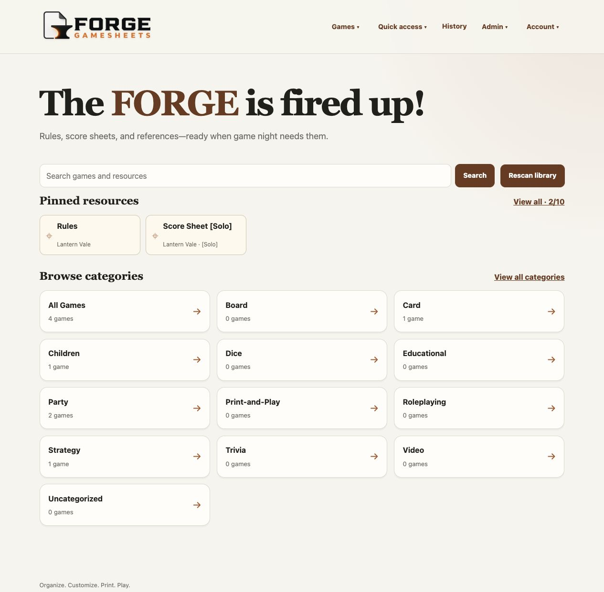 | 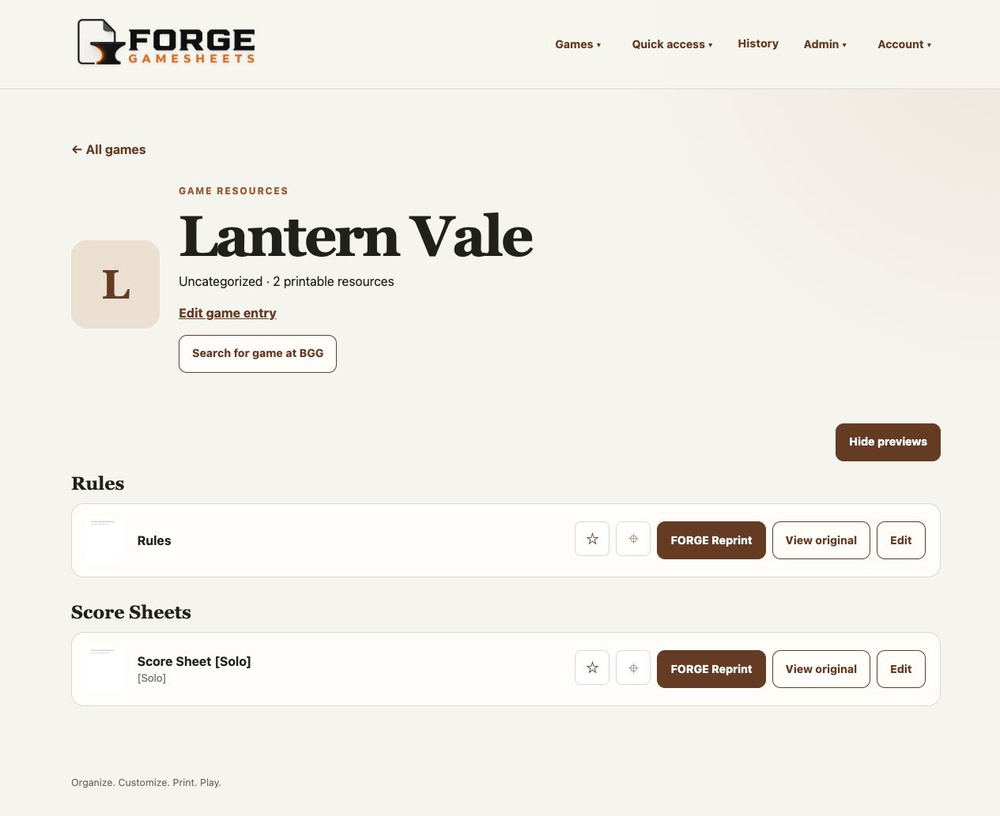 |
| **Bulk game categories** | **Bulk Reprint maintenance (earlier heading)** |
| 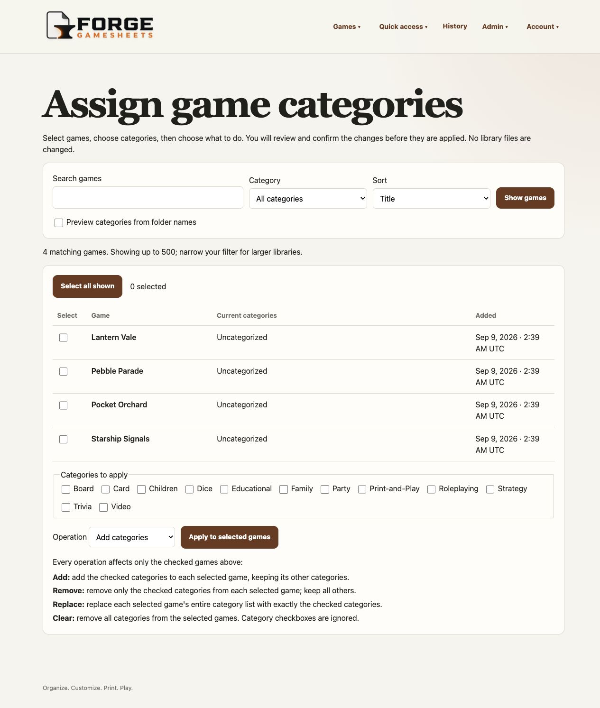 | 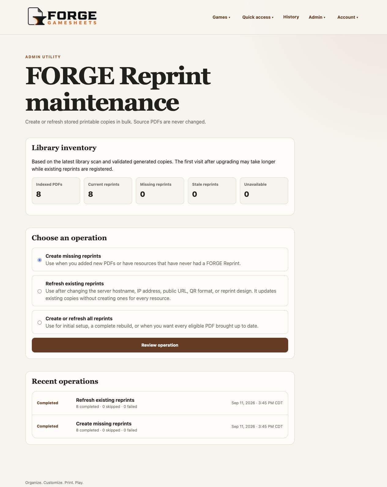 |
| **User Accounts** | **Activity History** |
| 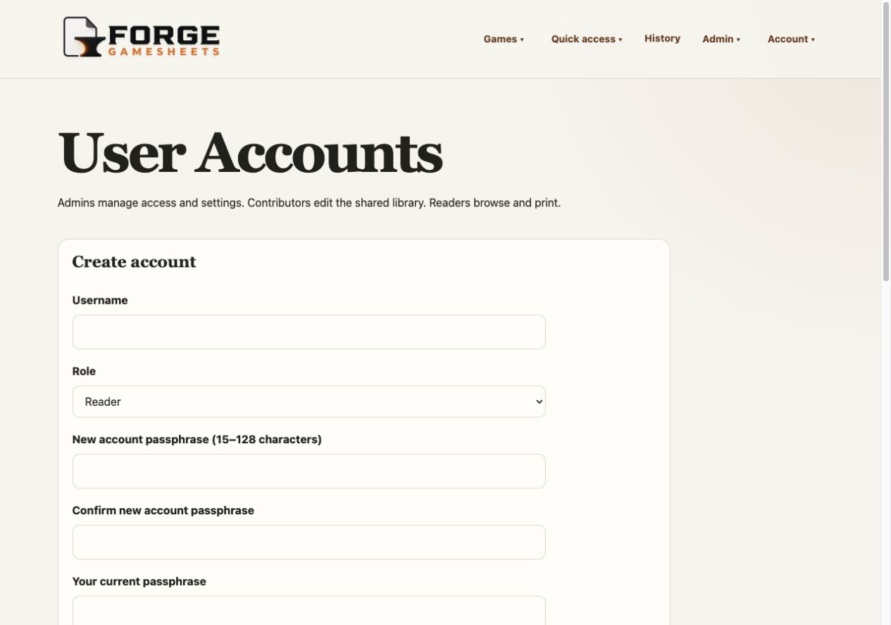 | 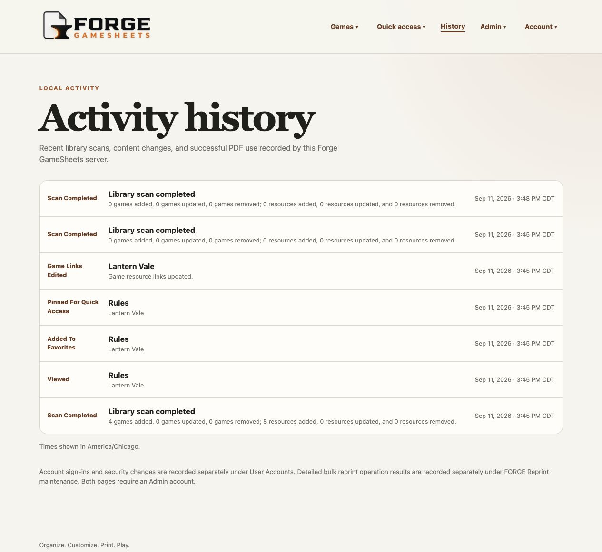 |
| **Integration and build details** | **Sheet Designer (earlier controls)** |
| 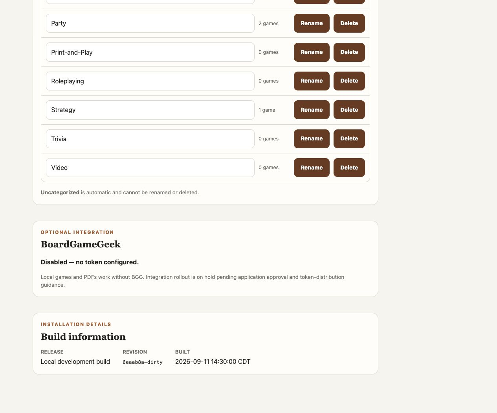 | 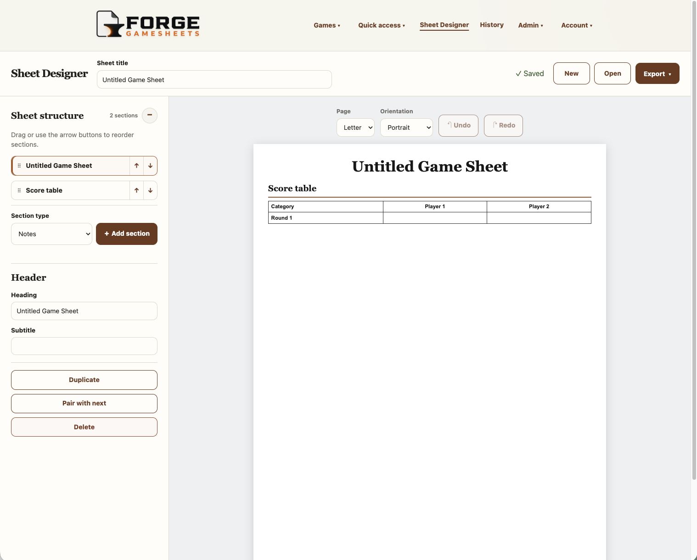 |
| **Designer startup (earlier copy)** | **Saved sheets and import** |
| 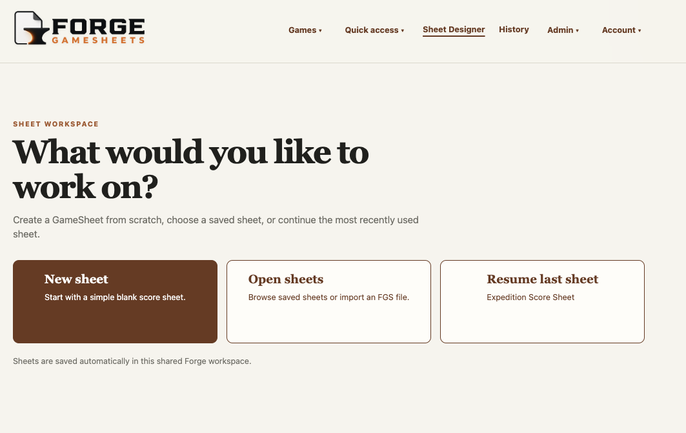 | 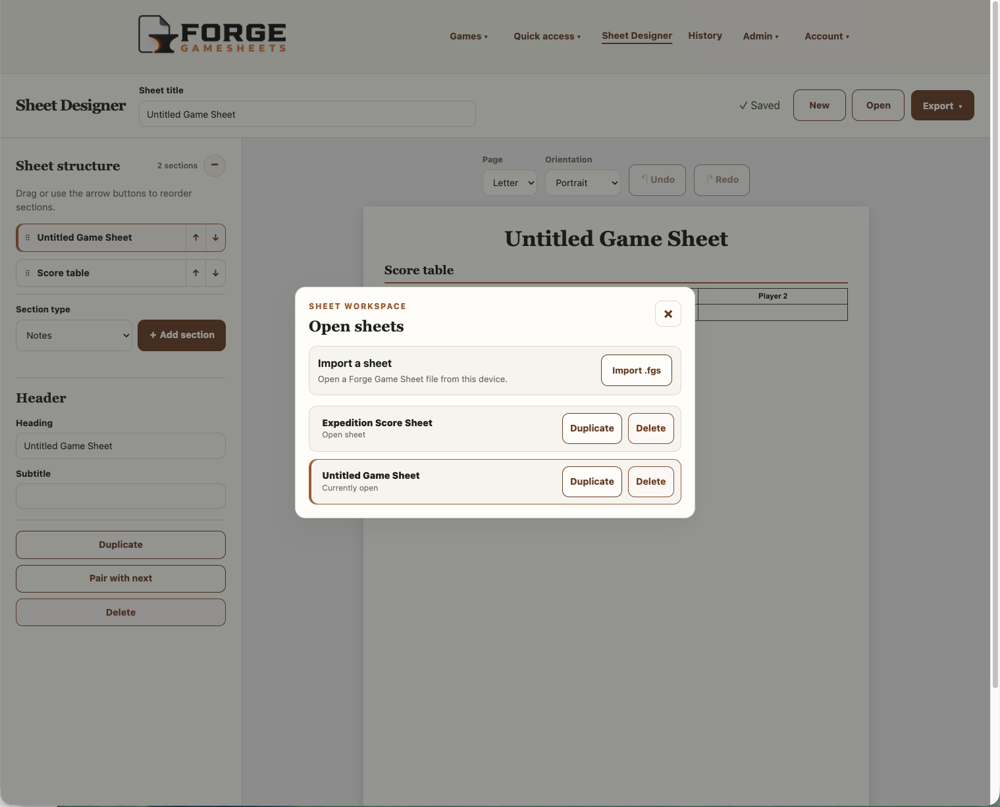 |
| **BoardGameGeek integration** | **Active LiveSheet** |
| 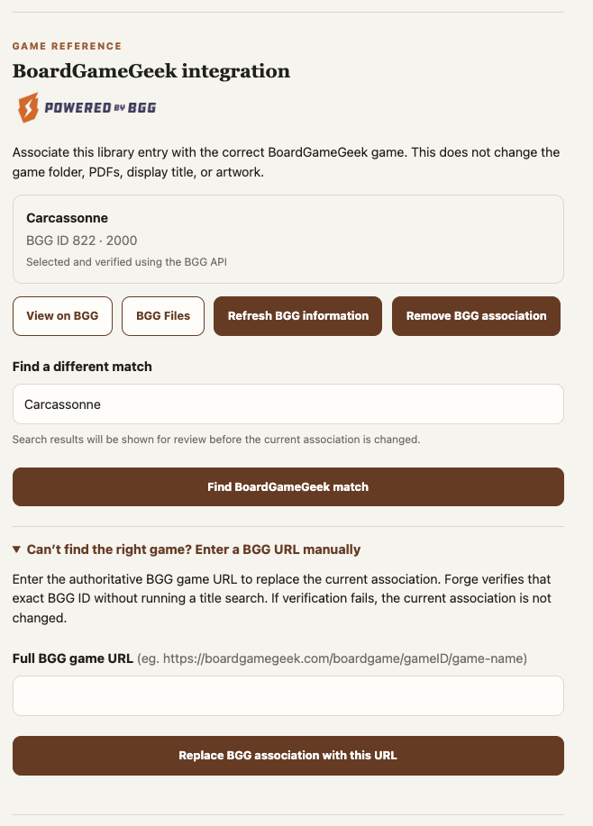 | 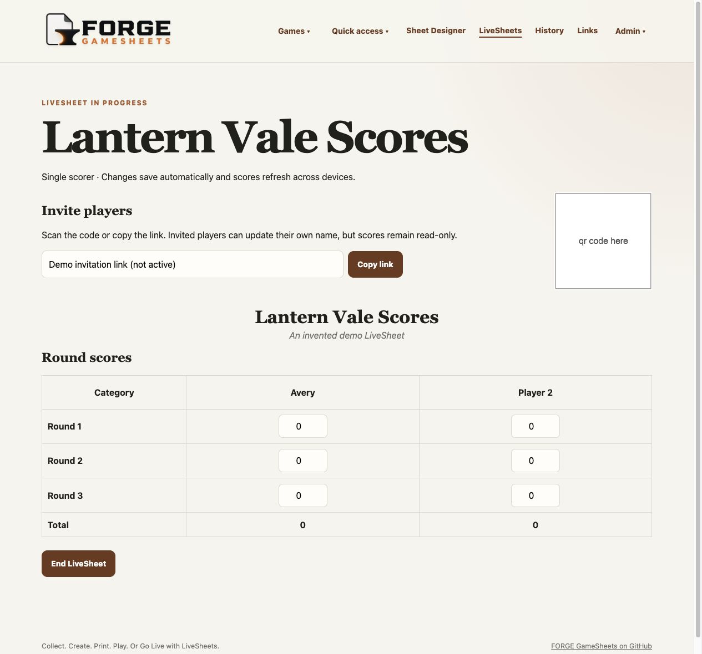 |

The LiveSheet image was captured from the application using a disposable
fictional sheet and temporary local database. For that capture only, the
invitation field displayed **Demo invitation link (not active)** and the QR
image endpoint returned the non-scannable words **qr code here**. No working
invite URL, QR code, credential, or personal library content appears in the
committed image. The application and its real sharing behavior were not changed.
